# faceView

A multimodal desktop GUI for interacting with Claude and other LLMs — chat, microphone, webcam, and a face-aware status surface, with a local control API and stdio MCP server so a Claude Code session can drive the GUI itself.

<p align="center">
  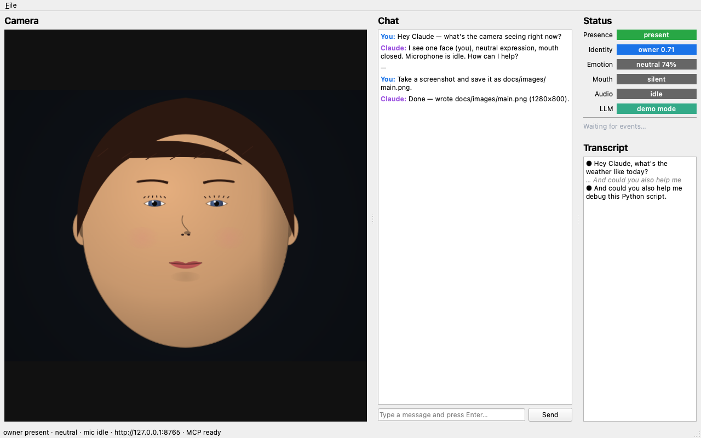
</p>

The left panel is a live camera feed. The centre is a chat panel with streaming Claude responses (with a built-in demo-mode fallback if no API key is set). The right column shows live presence/identity/emotion/mouth-activity status pills, plus a streaming STT transcript. A 127.0.0.1 FastAPI control plane and a stdio MCP server expose every operation as a tool — so Claude Code can take a screenshot of itself, send a chat message, query camera state, or speak text out of the GUI without leaving the conversation.

## Highlights

- **PySide6 GUI** with one `QThread` per heavy stage (audio, video, ML inference, LLM, server) and an in-process pub/sub bus built on Qt signals — thread-safe by construction via `Qt.QueuedConnection`.
- **Vision pipeline**: webcam → MediaPipe presence + 478-point landmarks → InsightFace ArcFace owner-vs-stranger → DeepFace emotion → mouth-activity / viseme detection. All ML deps are **lazy-imported**, so the GUI shell, tests, and CI screenshot capture run with the minimum install.
- **Speech pipeline**: `sounddevice` mic → silero-vad → faster-whisper STT → Anthropic Claude → pyttsx3 TTS. Same lazy-import policy.
- **Procedural simulated face** (`faceview.vision.sim_face` + `SimCameraWorker`) that drives the entire pipeline without a webcam — used for headless tests and the screenshots in this README.
- **Live + headless screenshot** capture via `widget.grab().save()`, working under `QT_QPA_PLATFORM=offscreen` so CI can produce real PNGs.
- **Driveable from Claude Code** via either:
  - `POST /chat`, `/speak`, `/screenshot` and `GET /state`, `/events` on `127.0.0.1:8765`
  - or a stdio MCP server exposing the same operations as native Claude Code tools.

## Lip-reading scope — read this first

A genuine open-vocabulary visual-speech-recognition (VSR) model from Python on Apple Silicon is **not practical in 2026**: the SOTA checkpoints (AV-HuBERT / Auto-AVSR) assume CUDA + fairseq, MPS throughput is poor, and word-error-rate on a casual webcam still sits in the 30–60% range without audio.

What faceView actually ships under "lip reading" is **mouth-activity + viseme detection**: per-frame jaw-open, mouth-funnel, and mouth-pucker coefficients derived from MediaPipe's 478-point face mesh, mapped to a small viseme alphabet (`AA / EE / OO / MM / FV`) plus a binary `speaking / silent`. It's enough to drive face-rig animation and to gate STT on visible mouth motion. For *transcripts*, faceView routes audio to faster-whisper.

The upgrade path to real VSR (Auto-AVSR converted to ONNX and run via `onnxruntime` CoreML EP) is documented in `INTERFACE.md` and is purely additive — drop in a new `vision/visual_asr.py` worker that subscribes to `FRAME` events.

## Live demo — full GUI + ICT avatar driven by HTTP

<p align="center">
  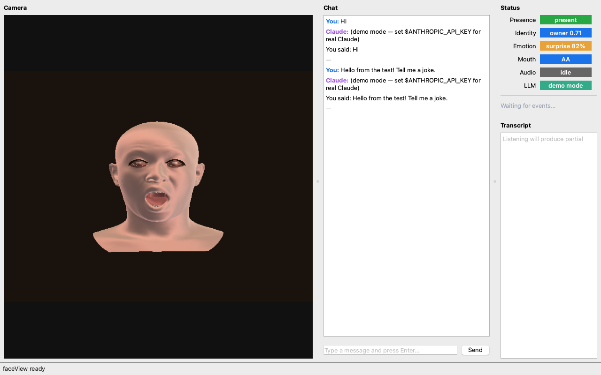
</p>

*Live `FACEVIEW_AVATAR=1 faceview` session. ICT-FaceKit head in the camera panel, real anatomical mouth open showing teeth and tongue from `POST /avatar/emotion {name: "surprised"}`. Status pills update in real time: `surprise 82% / mouth AA / owner 0.71`. Chat panel shows the conversation; the GUI also responds to `POST /chat`, `POST /avatar/say`, `POST /avatar/persona` and a stdio MCP server.*

## Talking avatar — Claude's face

faceView ships an animated 3D head — the **ICT-FaceKit** photo-real avatar — driven by Claude's chat replies. Set `FACEVIEW_AVATAR=1` and the camera panel becomes Claude's face: smooth Phong-shaded skin, real ARKit blendshapes for expression, GPU-accelerated through Apple Metal.

```bash
# One-time setup (after pip install):
git clone --depth 1 https://github.com/USC-ICT/ICT-FaceKit /tmp/ICT-FaceKit
python -m tools.build_ict_blendshapes /tmp/ICT-FaceKit
# Now run:
FACEVIEW_AVATAR=1 faceview
```

<p align="center">
  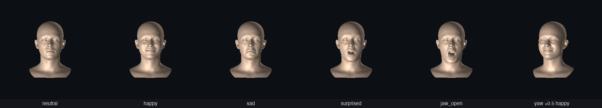
</p>

*Six FACS-driven states: **neutral / happy / sad / surprised / jaw_open / yaw +0.5 happy**. Real teeth visible when the jaw opens, lip corners pull on smile, smooth skin shading via subsurface-scattering shader (wrap diffuse + terminator SSS + dual specular + Fresnel rim).*

### Different personas (sex × age)

The ICT mesh ships with 100 PCA identity shape modes — combinations produce visibly different individuals. faceView ships a **persona library** with male / female × young / middle-aged / elder presets. Each persona also carries skin tone, hair colour, and lip colour.

<p align="center">
  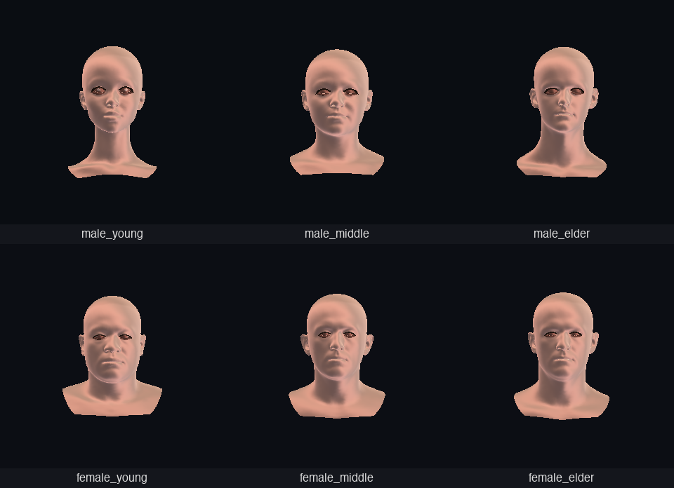
</p>

*Six bundled personas: `ict_male_young / male_middle / male_elder / female_young / female_middle / female_elder`. Plus `ict_claude / ict_alt1 / ict_alt2` for character variety. Switch at runtime via `POST /avatar/persona` or persona JSON.*

### How it works

1. **FACS Action Units** — 12 standard AUs (`AU1` Inner-brow-raise … `AU26` Jaw-drop) form the avatar's state. Adapted from [FaceForge](https://github.com/gddickinson/face_app)'s anatomy app, with `assets/config/expressions.json` providing 12 emotion presets (neutral, happy, sad, angry, surprised, fear, disgust, contempt, pout, kiss, pain, thinking).
2. **Visemes** — a 15-class alphabet (`PP / FF / TH / DD / SS / SH / KK / RR / AA / EH / IH / OH / UH / WW / REST`) maps each phoneme to a small AU activation. Mouth AUs (25/26/22/20/12) only — the rest are left to the baseline expression, so a smiling speaker keeps smiling.
3. **Speech engine** — text is tokenised into ARPAbet phonemes via a small bundled CMU pronouncing dictionary, with a letter-rule fallback for unknown words. Phonemes are timed at ~12/sec by default, producing a `TimedViseme` schedule the avatar plays back.
4. **Idle behaviours** — `AutoBlink` (every 2.5–5 s), `AutoBreathing` (slow sinusoid biasing AU9 / AU25), `AutoSaccade` (gaze drift every 1.2–2.6 s). All run continuously, even mid-utterance.
5. **Smoothing** — exponential approach (`rate × dt`) toward target AUs each tick. Produces visibly natural motion without per-AU velocity tracking.

The whole avatar is render-agnostic: `TalkingAvatar.tick()` returns a `FaceParams`, and the same `render_face()` renderer paints it. Tests verify that `say(text)` produces real jaw motion, blinks fire within 6 seconds idle, and emotion changes flip the smile sign.

### Personas

Appearance is decoupled from animation. The dynamic AU state (mouth open, brow up, smile, gaze, blink) lives on `FaceState`; the static identity bits (skin tone, hair colour, lip colour, background) live in a `Persona` overlay applied to every rendered frame. Bundled presets are in `src/faceview/assets/config/personas.json` and a `Persona` switch is exposed via HTTP `POST /avatar/persona` and MCP `set_persona`.

<p align="center">
  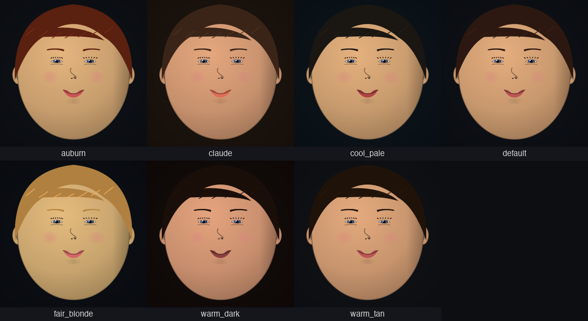
</p>

*Seven bundled personas at the same `happy` baseline — same animation pipeline, different appearance overlay.*

### Coarticulation

Visemes are not played as discrete steps. Each viseme contributes during a triangular envelope (40 ms attack, 60 ms release) around its phoneme slot, and `viseme_blend_at()` returns a per-AU weighted-max across active envelopes. The result is continuous AU trajectories: an outgoing viseme fades down as the incoming one ramps up, instead of snapping. The avatar's smoothing layer then sits on top.

### Anatomical renderer

A second renderer is shipped alongside the stylised one. It is built on a hand-curated 86-point landmark template at canonical face proportions (rule of thirds, eye spacing, lip rest position) and the **43 expression muscles** lifted from [FaceForge's anatomy app](https://github.com/gddickinson/face_app)'s catalogue, with each muscle's AU map preserved. Every AU activation resolves through the muscle layer to produce 2D vertex displacements with anatomical direction — zygomaticus major lifts the lip corner up *and* outward, levator labii alaeque nasi pulls the upper lip and nasal wing together, mentalis pushes the lower lip up via the chin pad — before any drawing happens.

<p align="center">
  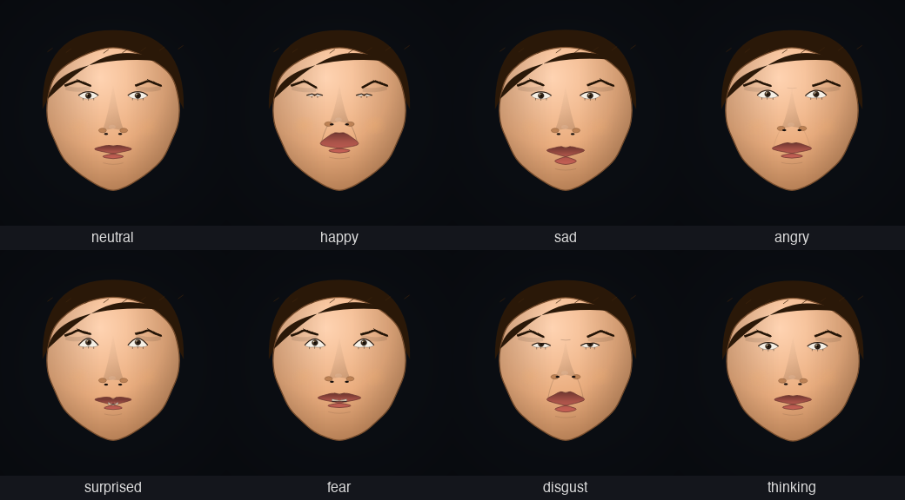
</p>

*Eight FACS-driven emotions rendered through the anatomical pipeline. Same model — only the AU mix changes. Note the nasolabial fold appearing on smiles, the cupid's bow + vermillion border on lips, the mentolabial sulcus under the lower lip, the limbal ring on each iris, and AU9-driven nasal wrinkle on disgust.*

<p align="center">
  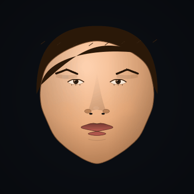
  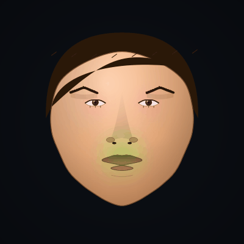
</p>

*Left: anatomical talking avatar — same FACS / phoneme / viseme pipeline as the stylised version, just routed through the muscle-driven landmark deformation. Right: the **anatomy overlay** mode shows each muscle glowing in proportion to its current activation, fiber direction drawn as a tick. Watch zygomaticus light up on a smile, orbicularis oris contract for `OO`, mentalis fire when the jaw closes.*

### Anatomical layers (skull / brain / muscles / eyeballs / skin)

A second illustrative-anatomy track sits alongside the talking-head renderer. Each layer is a self-contained drawer, and the layered compositor stacks them back-to-front with per-layer alpha. Toggleable via `Persona.render_mode`.

<p align="center">
  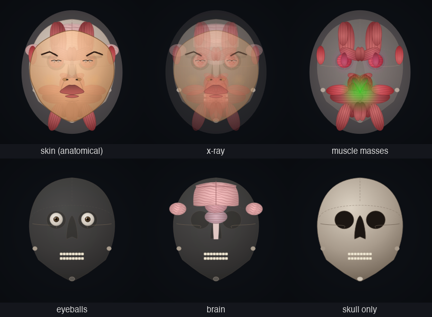
</p>

*Six anatomy layers, same pose. Skin (top-left) is the standard anatomical render. The others peel layers away — x-ray (translucent stack), muscle masses (43 expression muscles + AU activation tint), eyeballs (full sphere globes with optic nerves visible), brain (4 cerebral lobes + cerebellum + brainstem), skull (cranium, orbits, pyriform aperture, mandible + teeth).*

<p align="center">
  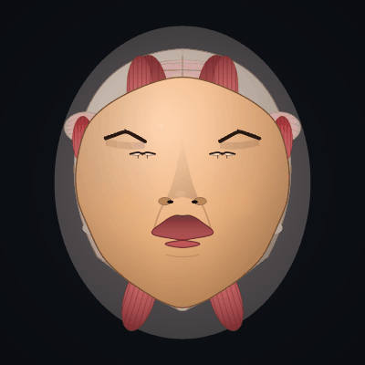
</p>

*Peel-away cycle: skin fades to muscles to skull to brain and back. All on the same FACS-driven landmark template, so you can run the animation while peeling.*

### Photo-anatomical mode (BodyParts3D)

For medical-imaging quality, faceView ships a small CPU rasteriser that renders the **head + neck STL subset** of [BodyParts3D](https://lifesciencedb.jp/bp3d/). The full catalogue is lifted from the [FaceForge](https://github.com/gddickinson/face_app) anatomy app — 20 skull bones, 7 cervical vertebrae, 43 expression muscles, 22 jaw muscles, 38 neck muscles, 8 face features (eyes / ears / nose cartilages / eyebrows), and 1 face skin mesh — each with its own FMA identifier, colour, opacity, shininess, and draw order. Populate the meshes once with:

```bash
python -m tools.copy_anatomy_meshes /path/to/bodyparts3D/stl
```

This copies ~145 head/neck STLs (~150 MB) into `src/faceview/assets/anatomy_meshes/` (gitignored). After that, render mode `faceforge_3d` renders them via Phong (ambient + diffuse + specular) lighting with per-mesh materials, draw-order layering (bones → muscles → skin), Z-sorted polygon paint, and yaw/pitch from `FaceParams`.

<p align="center">
  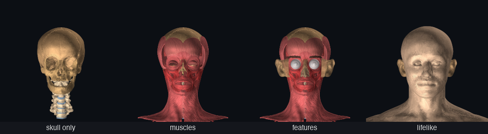
</p>

*Four layer sets at the same neutral pose: **skull_only** (cranium + cervical spine), **muscles** (~100 muscle masses with skull faintly behind), **features** (muscles + eyeballs + ears + nose cartilages), **lifelike** (everything plus translucent face skin on top). All from the same `render_face` dispatcher with `Persona.render_mode = "faceforge_3d"`.*

<p align="center">
  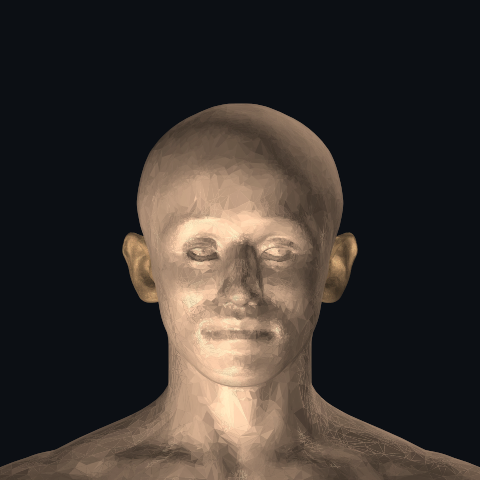
  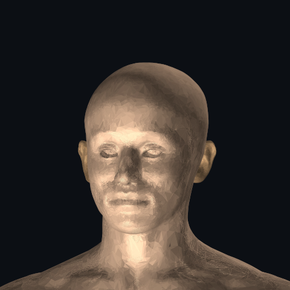
</p>

*The lifelike preset at front and 3/4 view — real BP3D skin mesh over the underlying anatomy, with Phong specular highlighting the cheekbone and brow ridge. No textures, just per-mesh materials and CPU rasterisation.*

<p align="center">
  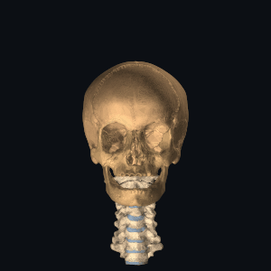
</p>

*Skull + cervical vertebrae rotating live (CPU). The full lifelike mode is too compute-heavy for animation on the CPU rasteriser — see GPU section below.*

### GPU rendering — Apple Metal via OpenGL

The `faceforge_3d_gpu` mode uploads the BP3D meshes once into VBOs and renders them through a Phong shader on Apple Silicon's Metal compatibility layer (via `moderngl`'s standalone OpenGL 4.1 context). On an M1 Max it runs at **~36 fps for the full 145-mesh head** — the only path that gets the lifelike anatomy into a real-time GIF.

```bash
pip install moderngl   # one-time
```

<p align="center">
  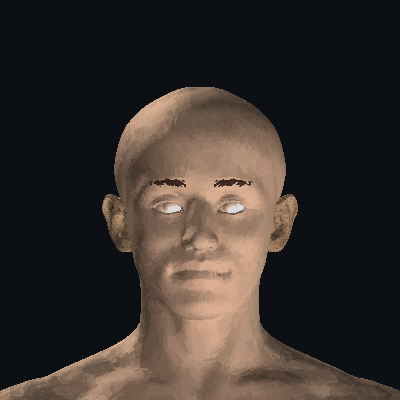
</p>

*BP3D head rotating in real time on the GPU. Same mesh data + materials as the CPU `faceforge_3d` mode, just routed through Metal. Each frame ~28 ms after the one-time mesh upload.*

### ICT-FaceKit — realistic animated 3D (`ict_face_3d`)

The realistic-animated endpoint. [USC ICT-FaceKit](https://github.com/USC-ICT/ICT-FaceKit) is an MIT-licensed morphable face model from USC's Vision and Graphics Lab — 26 719 vertices, 52 220 triangles, **157 blendshapes** captured from real scans, including the full ARKit 52-shape vocabulary. Each blendshape ships as a separate OBJ; we pre-compute per-vertex deltas as a 23 MB compressed `.npz`.

```bash
# One-time setup after copy_anatomy_meshes:
git clone --depth 1 https://github.com/USC-ICT/ICT-FaceKit /tmp/ICT-FaceKit
python -m tools.build_ict_blendshapes /tmp/ICT-FaceKit
```

After that, render mode `ict_face_3d` (or persona `ict_face_3d`) gives an animated lifelike head at **~24 fps with the SSS shader** (88 fps with the basic Phong shader) through `moderngl`. The same FACS pipeline that drives our 2D modes feeds in: `FaceParams → AU values → ARKit coefficients → ICT vertex deltas → GPU Phong/SSS render`.

### Different base faces (male / female / Claude)

ICT-FaceKit ships with **100 PCA identity shape modes** layered on top of the neutral mesh — different combinations produce visibly different individuals. Per-persona `identity_weights` in `assets/config/personas.json` lets you bake named base faces:

```json
"ict_male": { "identity_weights": { "identity000": 2.5, "identity002": -1.5, ... } },
"ict_female": { "identity_weights": { "identity000": -2.5, "identity003": 2.0, ... } },
"ict_claude": { "identity_weights": { "identity001": 1.8, "identity006": 1.5, ... } }
```

<p align="center">
  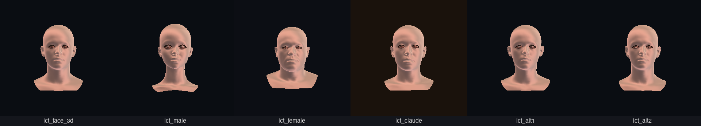
</p>

*Six base-face variations from the same 26K-vertex ICT mesh, driven only by different identity_weights coefficients. The FACS expression pipeline runs on top of any of them.*

<p align="center">
  
</p>

*ICT-FaceKit at six FACS-driven states: **neutral / happy / sad / surprised / jaw_open / yaw +0.5 + happy**. The mouth opens with visible teeth and tongue. Smiles pull lip corners up. Each expression is a real anatomical scan, not a synthetic deformation.*

<p align="center">
  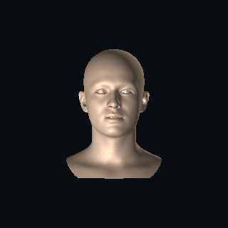
  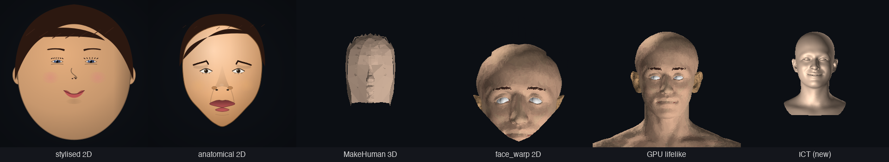
</p>

*Left: ICT face speaking, ARKit blendshapes driven by our SpeechEngine viseme pipeline. Right: realism progression from `stylised 2D` → `anatomical 2D` → `MakeHuman 3D` → `face_warp 2D` → `GPU lifelike` → `ICT (new)`.*

### Image-warp realistic face (`face_warp_2d`)

The most lifelike *animated* mode. Renders the BP3D photo-anatomical head once at neutral pose via the GPU pipeline, saves the result as a texture, and at runtime warps that texture using piecewise-affine deformation driven by the same FACS-driven landmark pipeline. The source pixels are real medical-imaging anatomy; the warp deforms small triangles so features slide in response to AU activations.

```bash
# One-time after copy_anatomy_meshes:
python -m tools.render_neutral_face_texture
```

<p align="center">
  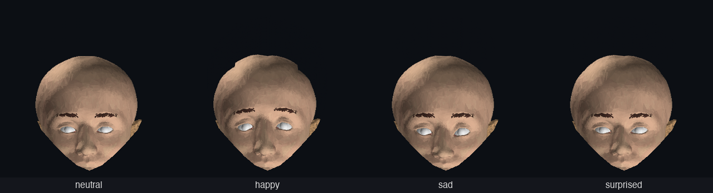
</p>

*Four emotions through `face_warp_2d` — same source texture, different AU-driven landmark deformation per frame.*

<p align="center">
  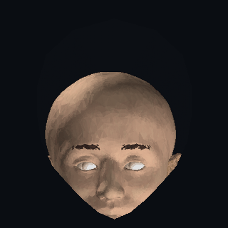
  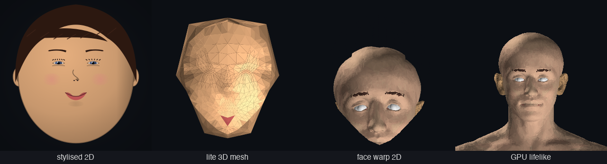
</p>

*Left: warped face speaking — same SpeechEngine + viseme pipeline as the rest of the avatar system, just routed through image warping. Right: four rendering tracks at the same expression — `stylised 2D` (cartoony), `lite 3D mesh` (low-poly), `face warp 2D` (photo-real animated), `GPU lifelike` (full 3D rotatable).*

Pros: photo-real, fast on CPU (~25 fps), uses the existing FACS animation pipeline. Cons: locked to front view (no rotation — pair with `faceforge_3d_gpu` for that).

### Head 3D lite — animatable middle ground

The CPU lifelike renderer is too heavy to animate, and the stylised 2D path doesn't have depth. `head_3d_lite` sits between them: takes the existing 86 anatomical landmarks, adds hand-tuned Z depth per group (nose tip protrudes, temples recede, ears further back, scalp dome, neck-front), closes the silhouette with ~19 back-of-head and neck points, runs SciPy Delaunay over the front face, and z-sorts the result through QPainter. Result: a low-poly 3D head you can rotate **and** drive with FACS — at ~55 fps on a single CPU core.

<p align="center">
  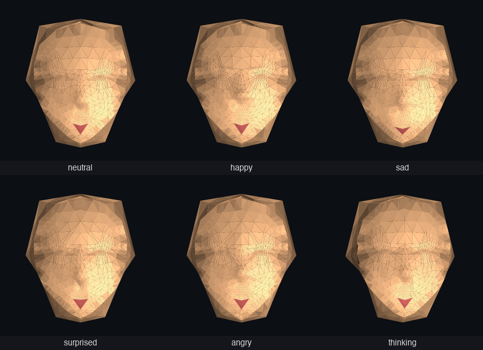
</p>

*Six FACS emotions in the lite 3D pipeline. Same `apply_expression()` → `face_state_to_params()` → AU-driven landmark deformation as the 2D anatomical mode — only the renderer differs. The mesh is shaded with a Phong-style per-triangle Lambert + specular term.*

<p align="center">
  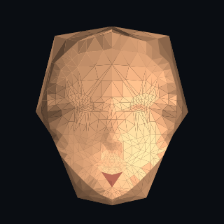
</p>

*Lite 3D head speaking, same SpeechEngine + viseme-blend pipeline as the rest of the avatar system, with a slow yaw oscillation. Real-time animation on CPU.*

<p align="center">
  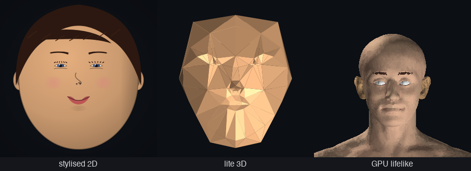
</p>

*The three new render tracks side-by-side: **stylised 2D** (cartoony, fastest), **lite 3D** (animatable, low-poly with depth + rotation), **GPU lifelike** (photo-anatomical from real BP3D meshes, ~36 fps via Apple Metal).*

## Full-body avatar + head nod

The ICT-FaceKit head can be transplanted onto a procedural human body
(male + female 10.5K-vertex OBJs, blended by a `body_morph ∈ ±1`
slider). The body carries 16 per-vertex BPF labels (neck / chest /
abdomen / pelvis / upper-arm / forearm / hand / thigh / shin / foot
× L/R) painted once and baked into NPZs at the two morph extremes.
A hierarchical rig drives 28 body effects (arms_up, salute, kick_left,
squat, …) via per-region bone rotations.

Head rotation is the cervical cascade in `_apply_cervical_cascade`.
The default mode `head_block_neck_stretch` (selected via
`FACEVIEW_NOD_MODE`) does a single rigid rotation around an ear-level
back-of-neck pivot (atlanto-occipital joint), with the throat
smoothstep-blending toward rest so the neck stretches/compresses to
absorb the motion. The body below stays anchored.

```bash
# Run the GUI with the procedural body + head-nod cascade
FACEVIEW_AVATAR=1 faceview

# A/B alternative cascades
FACEVIEW_NOD_MODE=cranium_only       faceview   # only the cranium rotates
FACEVIEW_NOD_MODE=head_block_short_neck faceview # tighter stretch zone
FACEVIEW_NOD_MODE=current             faceview   # legacy
```

`tools/_nod_motion_overlay.py` and `tools/_quadrant_motion_assess.py`
generate cyan-rest / red-pitched silhouette diffs per mode and
quantify motion in the above-ear vs below-ear regions; see the saved
overlays in `docs/images/nod_overlay_*.png`.

### Render-mode reference

Switchable at runtime via `POST /avatar/persona`:

| Mode | Track | Use |
|---|---|---|
| **`ict_face_3d`** | **realistic 3D — top mode** | USC ICT-FaceKit (MIT) — 26 719 verts, 157 ARKit-named blendshapes from real face scans. Per-material colours (face / teeth / sclera / iris / lips / lashes), wrap-diffuse + dual-lobe specular + subsurface-scattering tint at the terminator + sky-tinted ambient + Fresnel rim. Eye-specific glossy specular for wet-eye look. **~24 fps on Apple GPU.** |
| `face_warp_3d` | photo-real animated | 5-yaw atlas blend — photo-real face that *rotates* AND deforms with FACS. ~7 fps. |
| `face_warp_2d` | photo-real animated | Single-texture warp, FACS-driven. Front view, ~25 fps. |
| `faceforge_3d_gpu` | photo-anatomical | Real BodyParts3D meshes (~145 structures). ~36 fps. Layer sets: `skull_only` / `muscles` / `features` / `lifelike` / `xray`. |
| `faceforge_3d` | photo-anatomical | CPU equivalent — Phong-shaded, slower. |
| `head_decimated_3d_gpu` | 3D animated | Decimated BP3D skin via moderngl. Real anatomy at low poly. |
| `head_decimated_3d` | 3D animated | CPU rasteriser. ~8 fps; use the GPU path. |
| `makehuman_3d` | 3D animated | MakeHuman base mesh (CC0). Cleaner topology than decimated BP3D. |
| `anatomical` | 2D portrait | FACS landmarks + shaded skin + real eye/lip/nose anatomy. |
| `anatomy_layers` (+ `_skull`, `_brain`, `_muscles`, `_eyeballs`, `_xray`) | 2D illustration | Layered anatomy peelable view. |
| `stylised` | cartoony | Default — fast expressive avatar. |
| `wireframe` / `anatomy_overlay` | debug | Landmark / muscle activation overlays. |

## The simulated face — building blocks

`FaceParams` is the renderer's input (yaw / pitch / eye_open / jaw_open / smile / brow_raise / pupil_x / pupil_y / skin_hue). `FaceState` is the animation pipeline's input (12 FACS AUs + head pose + gaze + blink). The bridge is `face_state_to_params()`. A `SimCameraWorker` posts `FRAME` events identical in shape to the real `CameraWorker`'s output, plus matching `PRESENCE / MOUTH_ACTIVITY / EMOTION / IDENTITY` events.

<p align="center">
  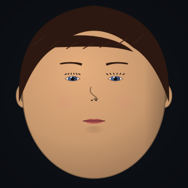
  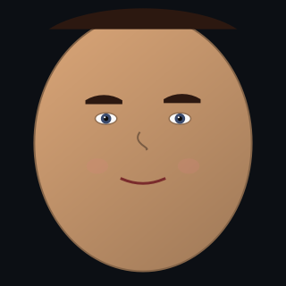
  
  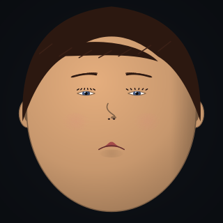
</p>

*Procedural face in four `FaceParams` presets. Used for tests, README screenshots, and any time a real camera isn't available.*

## States captured live from the GUI

<p align="center">
  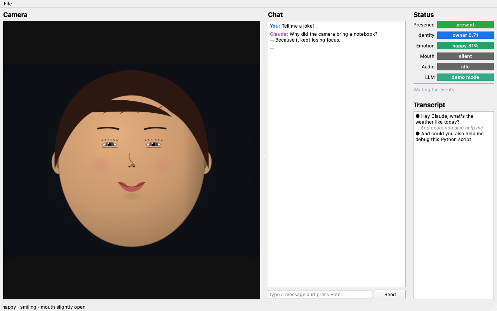
</p>

*Demo conversation, owner present, smiling — the emotion pill turns green at 81%, mouth pill stays "silent" because the closed-mouth smile has `jaw_open ≈ 0`.*

<p align="center">
  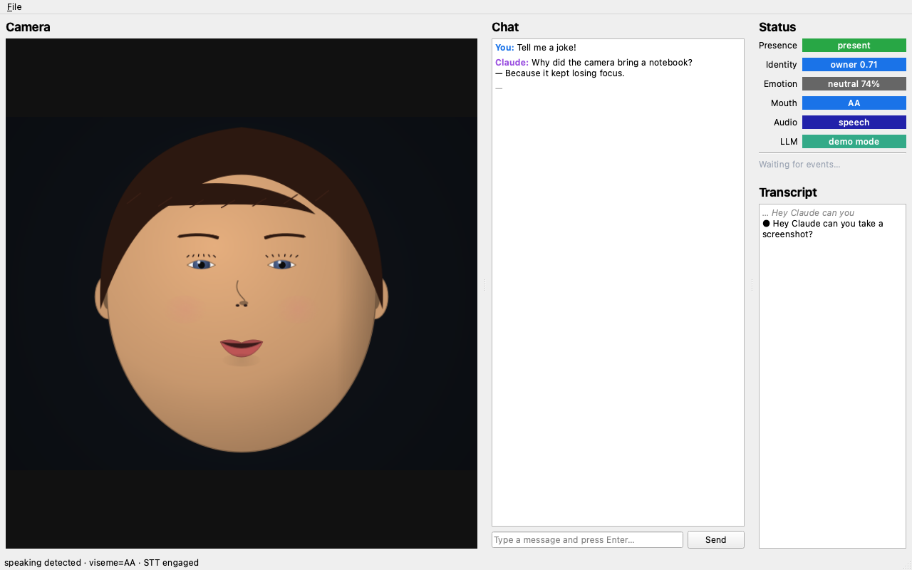
</p>

*Voice activity detected, transcript panel showing a partial line followed by the final segment, mouth pill snapped to viseme `AA`, audio pill to "speech".*

<p align="center">
  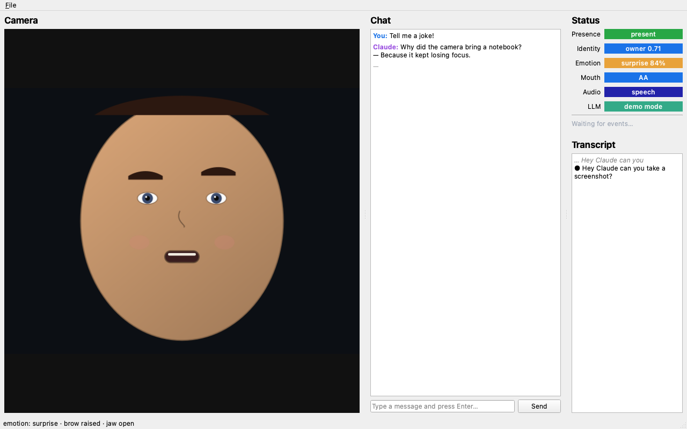
</p>

*Brow-raised, jaw-open: emotion classifier flips to "surprise" at 84%.*

<p align="center">
  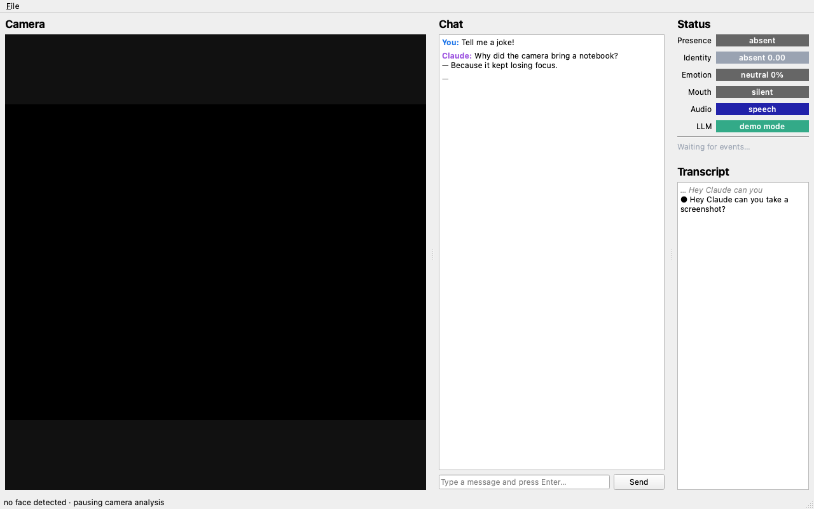
</p>

*No face in frame — presence drops to "absent", identity goes blank, vision analysis backs off automatically.*

## Layout

```
faceView/
├── src/faceview/
│   ├── core/           event bus, event types, logger, errors, config
│   ├── gui/            PySide6 widgets + screenshotter
│   ├── speech/         audio capture, VAD, STT, TTS  (lazy ML)
│   ├── vision/         camera, presence, identity, emotion, mouth
│   │                   + sim_face / sim_camera (procedural face)
│   ├── llm/            Anthropic client + conversation history
│   ├── server/         FastAPI + stdio MCP, sharing one Service layer
│   └── utils/
├── tests/              pytest-qt unit + smoke tests
├── tools/              run_headless, capture_gui_screenshots, run_mcp_server
└── docs/images/        screenshots used in this README (auto-captured)
```

See [`INTERFACE.md`](INTERFACE.md) for the full module map and event flow diagram.

## Install

```bash
conda create -n faceview python=3.11 -y
conda activate faceview

# Minimum: GUI + LLM + control API + tests
pip install -e ".[dev]"

# Optional ML extras (lazy-imported — install only what you want)
pip install -e ".[speech]"     # sounddevice, faster-whisper, silero-vad, pyttsx3
pip install -e ".[vision]"     # opencv-python, mediapipe
pip install -e ".[identity]"   # insightface, onnxruntime (with CoreML EP on macOS)
pip install -e ".[emotion]"    # deepface
pip install -e ".[mcp]"        # mcp Python SDK
pip install -e ".[full]"       # everything above
```

The minimum install is enough to launch the GUI, run all 17 unit tests, and capture every screenshot in this README.

## Run

```bash
# Live GUI
faceview
# or
python -m faceview

# Offscreen smoke run — boots, seeds demo state, saves docs/images/headless_smoke.png
python -m tools.run_headless

# Re-capture all README screenshots
python -m tools.capture_gui_screenshots

# Render the talking-avatar GIF + frame strip + monitor PNG
python -m tools.animate_talking
python -m tools.animate_talking --text "Hello, world." --emotion happy --speed 1.0

# Run the GUI in avatar mode (camera panel = Claude's animated face)
FACEVIEW_AVATAR=1 faceview

# Stdio MCP server (Claude Code launches this automatically once configured)
python -m tools.run_mcp_server
```

Set `ANTHROPIC_API_KEY` to enable real Claude responses. Without it, faceView automatically falls back to:

1. **Local Ollama** if `ollama serve` is reachable on `127.0.0.1:11434` and any model is installed (e.g. `ollama pull llama3.1:8b`). Pick the model via `FACEVIEW_OLLAMA_MODEL=llama3.1:8b` or accept the auto-pick (first installed llama/mistral/phi/qwen).
2. **Demo echo engine** as the last resort — keeps the GUI usable without any LLM at all.

```bash
export ANTHROPIC_API_KEY=sk-ant-...
export FACEVIEW_MODEL=claude-sonnet-4-6        # default
# OR
ollama pull llama3.1:8b                         # local fallback
export FACEVIEW_OLLAMA_MODEL=llama3.1:8b       # optional pin
```

## Driving the GUI from Claude Code

### Option 1 — HTTP control plane (always on at 127.0.0.1:8765)

```bash
curl -X POST http://127.0.0.1:8765/chat -H 'content-type: application/json' \
     -d '{"text":"What can you see?"}'

curl -X POST http://127.0.0.1:8765/speak -H 'content-type: application/json' \
     -d '{"text":"Screenshot saved."}'

curl -X POST http://127.0.0.1:8765/screenshot -H 'content-type: application/json' \
     -d '{"name":"my_shot.png"}'

# Avatar control (only effective when FACEVIEW_AVATAR=1)
curl -X POST http://127.0.0.1:8765/avatar/emotion -H 'content-type: application/json' \
     -d '{"name":"surprised"}'
curl -X POST http://127.0.0.1:8765/avatar/persona -H 'content-type: application/json' \
     -d '{"name":"claude"}'
curl -X POST http://127.0.0.1:8765/avatar/say -H 'content-type: application/json' \
     -d '{"text":"Hello there.","speed":1.0}'
curl http://127.0.0.1:8765/avatar/personas

curl http://127.0.0.1:8765/state    # camera state
curl http://127.0.0.1:8765/events   # last 50 events
```

### Option 2 — stdio MCP server

Add to your `~/.claude.json` (or run `claude mcp add ...`):

```json
"mcpServers": {
  "faceview": {
    "command": "python",
    "args": ["-m", "tools.run_mcp_server"]
  }
}
```

Then a Claude Code session can call `send_chat`, `speak`, `camera_state`, `list_events`, `screenshot`, `set_emotion`, `set_persona`, `avatar_say`, and `list_personas` as native tools. Both adapters wrap the same `Service` layer in `src/faceview/server/service.py`, so adding an op only takes one implementation.

## Testing

```bash
pytest                # 107 tests, all green
```

## External integration bridges

faceView speaks two industry-standard languages so it can plug into the broader virtual-human ecosystem:

```python
# Drive an external Unreal-rendered avatar over UDP (openFACS protocol)
from faceview.vision.openfacs_bridge import OpenFACSBridge
bridge = OpenFACSBridge()
bridge.attach_to_avatar(avatar)   # every tick now streams to UE on :5000

# Drive faceview from a webcam (MediaPipe FaceLandmarker — 52 ARKit blendshapes)
from faceview.vision.mediapipe_capture import MediaPipeCapture
from faceview.vision.arkit_blendshapes import arkit_to_au_values
cap = MediaPipeCapture()
au_values = arkit_to_au_values(cap.next_frame_blendshapes())
```

Tests run fully offscreen (`QT_QPA_PLATFORM=offscreen` is set in `tests/conftest.py`) and require only the `[dev]` extra — no real ML model is loaded.

## Threading model

Heavy work runs off the GUI thread on dedicated `QThread` workers, communicating exclusively via the `EventBus` Qt signal:

```
mic → AudioCapture → VAD → STT ──┐
                                 ▼
                              EventBus(Transcript)
                                 │
chat input → ChatPanel ──────────┴────► ClaudeClient ──► EventBus(LLM_TOKEN, LLM_REPLY)
                                                         │
                                                         ▼
                                                ChatPanel + TTSWorker

cam → CameraWorker ─► PresenceDetector ─► EventBus(Presence)
                   ├─► IdentityRecognizer ──► EventBus(Identity)
                   ├─► EmotionAnalyzer    ──► EventBus(Emotion)
                   └─► MouthAnalyzer      ──► EventBus(MouthActivity)

HTTP / MCP ─► Service ─(invokeMethod / signals)─► same handlers
```

`Qt.QueuedConnection` marshals every cross-thread call back onto the receiving object's thread, so no widget is ever touched off-main.

## Status

Alpha. The GUI shell, control API, MCP adapter, simulated-face pipeline, screenshot capture, and tests all work. Real-camera and real-microphone paths are implemented but each requires its optional extra to be installed; they have not been exhaustively tuned. Lip-reading is, and will remain, viseme/mouth-activity rather than open-vocabulary VSR.

## License

MIT.
