# faceView

> A face-to-face chat GUI for LLMs. Claude (or any local Ollama model) speaks
> through a real animated avatar with a natural neural voice, sees you via
> the webcam, listens through your microphone, and remembers you across
> sessions.

<p align="center">
  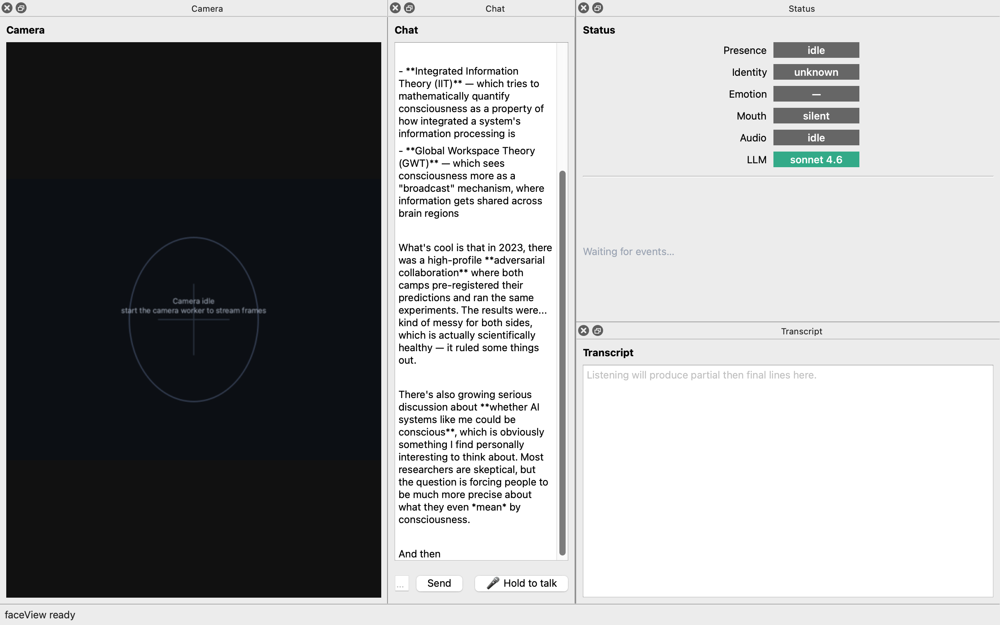
</p>

You type or speak; the avatar replies in voice and on screen. A persistent
per-persona **cognition** layer (episodic + semantic + emotional memory +
relationship progression + character sheet) is injected into the system
prompt every turn — so the same memories steer Anthropic, Ollama, or the
demo engine identically. Every panel is a detachable Qt dock; every
operation has a CLI + HTTP control surface so Claude Code can drive the
GUI from outside.

---

## Highlights

- **Eight characters, one engine-agnostic memory** — pick your default
  Claude (max-capability, ICT 3D face, British female voice) or swap to
  one of seven authored personas: Iris the neuroscience PhD, Bayard the
  retired guitarist, Niko the indie dev, Soraya the ER nurse, Theo the
  bookshop owner, playful cartoon Claude, or Iris on x-ray. Each has a
  full character sheet (Big Five traits, backstory, catchphrases, goals,
  preferred voice) and their own persistent memory file.
- **Natural neural voice** — Kokoro-onnx local TTS runs in real time on
  Apple Silicon CPU. 54 voices; each character has a defaulted voice
  (`bf_emma`, `bm_george`, `af_sky`, …). Pyttsx3 fallback if Kokoro
  isn't installed.
- **Real STT → LLM** — sounddevice mic → silero-vad → faster-whisper →
  bridged into the chat panel. Mic is auto-muted during TTS so the
  avatar doesn't echo itself; **🎤 Hold to talk** button interrupts the
  avatar and bypasses the echo gate.
- **Test mode: two bots conversing in character** — pick a partner
  persona and engine (canned / Ollama / Anthropic / demo). Each bot
  has its own `Conversation` + character; replies route through
  `chat_panel.append_external_message` so they don't re-trigger the
  main client.
- **Live engine swap** — change between Anthropic / Ollama / demo from
  the config dialog or CLI without restarting the app. Status pill
  reflects what's actually driving conversation (green = Anthropic,
  blue = Ollama, grey = demo, `⇄` prefix = test-mode override).
- **Detachable layout** — drag any panel out as a floating window, tab
  two panels together, hide one, save the arrangement with Cmd-Shift-Y,
  reset to defaults with Cmd-Shift-L. Persists via QSettings.
- **Persona editor** — Tools → Edit personas… (Cmd-Shift-I). Live edit
  any character's identity, traits, backstory, catchphrases, goals; save
  rebinds the running avatar.
- **Driveable from Claude Code** — `tools/faceview_drive.py` launches +
  controls the GUI, `tools/faceview_monitor.py` reads state. Both talk
  to a 127.0.0.1 FastAPI control plane; an MCP server adapter exposes
  the same surface as native Claude Code tools.
- **Ambient perception → system prompt** — every turn the LLM sees a
  live status block built from the camera (face count, recognised
  identity, emotion, gaze, head pose, distance, blink rate, gesture,
  scene brightness/motion, detected objects, and a short VLM caption
  refreshed every 15 s). The chat bot speaks with context, not blind.
- **12 LLM-callable image-analysis tools** — `look_at_camera`,
  `remember_person`, `read_text`, `track_object`, `check_visible`
  (open-vocabulary CLIP), `describe_color`, `describe_pose`,
  `face_attributes`, `scan_qr`, `estimate_depth`, `gaze_target`,
  `segment_object`, plus `describe_room_layout`. The model picks
  what it needs; faceView routes through the right local stack.
- **Top-down room map** — View → Room map… (`Ctrl+Shift+Z`). MiDaS
  monocular depth + EfficientDet detections projected to a plan
  view: FOV cone, dots per object with distance, motion trails,
  head-pose heading arrow. Optional metric calibration converts
  relative units to metres.
- **Per-person memory** — PeopleStore + multi-person identity. When
  Claude recognises you the cognition layer routes the turn into
  *your* memory bucket. Different friend, different thread.
- **Live cost + latency telemetry** — per-turn token counts (real
  from Anthropic + Ollama, estimated for demo), USD cost, wall-time,
  persisted to `~/.faceview/telemetry.jsonl` and shown live in a
  status pill colour-coded by spend.
- **OpenAI-compatible HTTP endpoint** — `/v1/chat/completions` +
  `/v1/models` on port 8765, so any OpenAI-SDK caller can use
  faceView as a drop-in local LLM that already knows what the
  camera sees.
- **Markdown + Ctrl+F in chat** — code fences, tables, bold/italic
  all render properly. Cmd/Ctrl+F opens an in-panel find bar with
  wrap-around and prefill-from-selection.

<p align="center">
  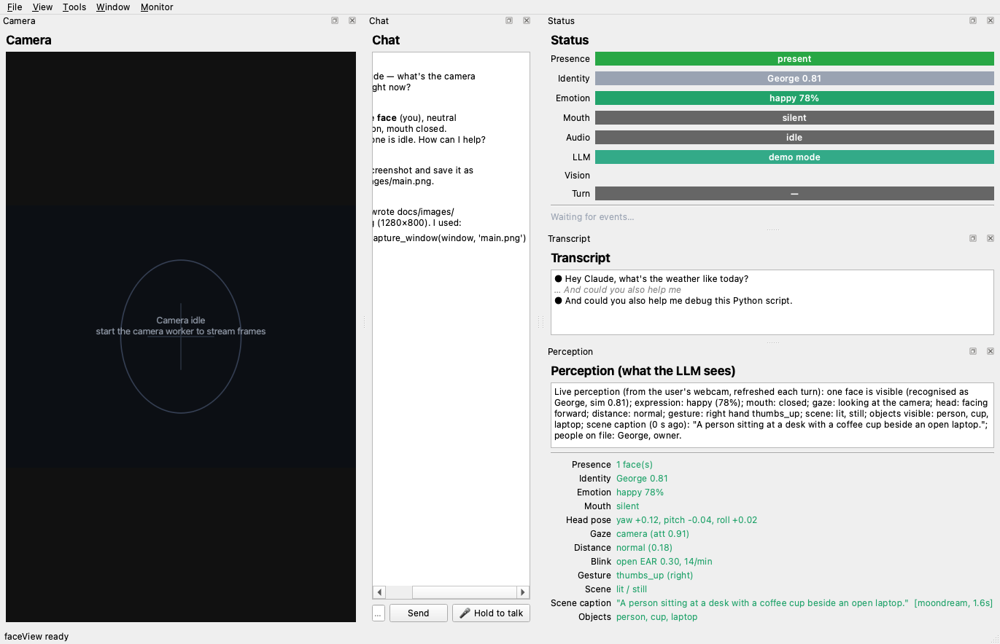
</p>
<p align="center">
  <em>Main window with the live <strong>Perception</strong> panel on the
  right showing what the LLM sees this turn — recognised face, emotion,
  gaze, gesture, scene caption, objects, plus the persistent roster of
  known people. The Status block's Vision pill flashes red whenever a
  frame leaves the host; the Turn pill shows last-turn latency + cost.</em>
</p>

---

## A face, a voice, a memory

The default avatar is **max-capability Claude** on the USC ICT-FaceKit
photo-real 3D head with an x-ray glow shader, speaking through the
`bf_emma` Kokoro voice (British female). Mood pill, status pills, and
the chat history all update in real time.

<p align="center">
  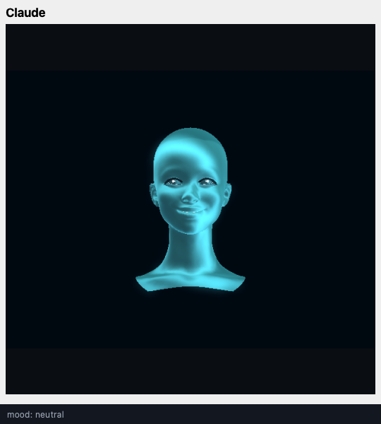
  &nbsp;
  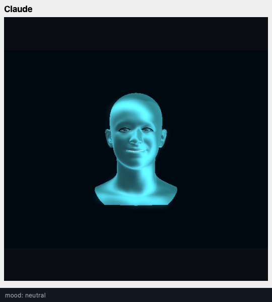
</p>

<p align="center">
  <em>Left: max-capability Claude (default boot persona — ICT face, <code>bf_emma</code> voice).
  Right: Iris, neuroscience PhD student, with a different voice (<code>af_nicole</code>) and
  her own conversation memory under <code>.faceview/memory/ict_xray.json</code>.</em>
</p>

<p align="center">
  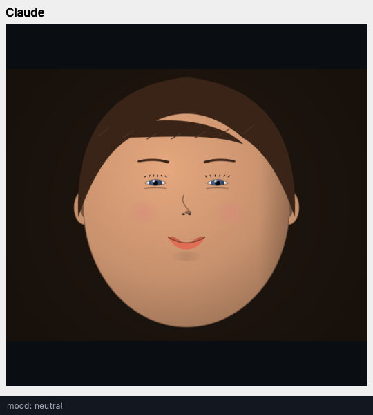
  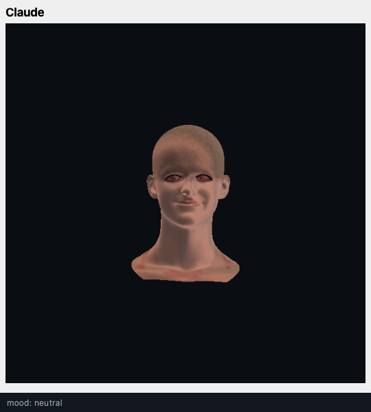
  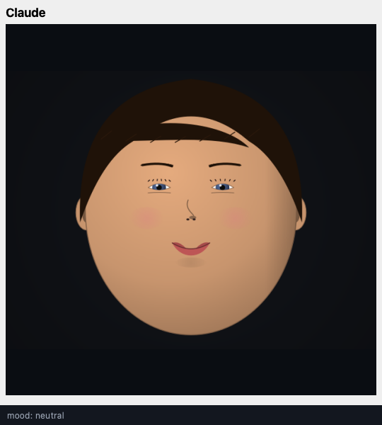
</p>

<p align="center">
  <em>Playful Claude on the stylised cartoon face, Bayard the retired classical guitarist,
  and Soraya the ER nurse. Each has a distinct backstory, catchphrases, Big Five trait
  profile, and Kokoro voice.</em>
</p>

---

## What the LLM is actually seeing (Perception panel)

Every chat turn, the system prompt gets a live narration block built
from a singleton `PerceptionStore` that subscribes to every vision
signal on the bus. The **Perception** debug panel (tabbed behind the
Transcript) shows the exact paragraph the model receives — colour-
coded by signal freshness so you can spot which ones are stale.

<p align="center">
  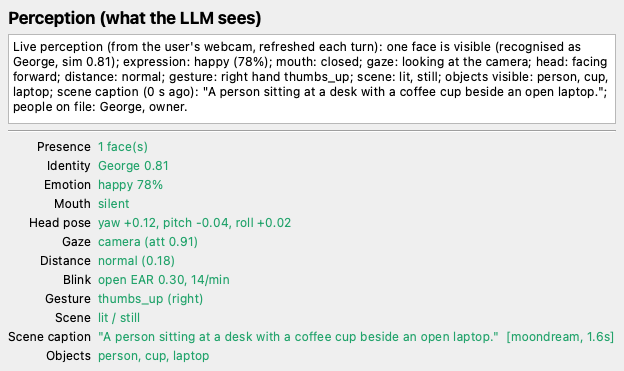
</p>

The narrative covers: presence + identity (with confidence), emotion
(deepface), mouth state + viseme, head pose, **iris-derived gaze**
direction, face distance, blink rate, hand gesture (MediaPipe), scene
brightness + motion, MP-detected objects, and an ambient **VLM
caption** (moondream by default, ~15 s cadence). The roster of
remembered people is appended so the LLM never quizzes someone the
system already knows.

Twelve on-demand tools sit on top — every one routed through *both*
Anthropic and Ollama engines so the model can fetch deeper info when
the structured signals aren't enough:

| Tool | Use it for |
|---|---|
| `look_at_camera(question?, region?)` | Full VLM caption — anything visual the structured signals don't cover. Anthropic uses its own vision; Ollama routes to moondream / llava / llama3.2-vision. |
| `remember_person(name)` | Save the currently-visible face under a name. Next session it's recognised automatically. |
| `read_text(region?)` | EasyOCR — read signs, slides, labels, screens. |
| `track_object(label, duration_s?)` | IoU-track a named EfficientDet detection across frames so the LLM can ask "is it still there?". |
| `check_visible(query)` | Open-vocabulary OpenCLIP — "is there a person wearing glasses?". |
| `describe_color(region?)` | k-means dominant colour. |
| `describe_pose()` | MediaPipe Pose — sitting / standing / leaning / arms crossed / hand raised. |
| `face_attributes()` | InsightFace age + gender. |
| `scan_qr()` | cv2 QR-code decoder. |
| `estimate_depth(region?)` | MiDaS monocular depth → coarse near/far summary. |
| `gaze_target()` | Combines iris + head-pose into "looking at: camera / screen / down / off-screen left…". |
| `segment_object(label)` | cv2.GrabCut seeded by EfficientDet bbox — foreground mask + zone. |
| `describe_room_layout()` | Reads the room-map store; one paragraph spatial summary. |

The model picks what it needs each turn. The status bar's **Vision**
pill flashes red whenever a frame is sent to a remote VLM
(Anthropic), orange for a local one — privacy hygiene.

---

## Room map — top-down plan view

View → **Room map…** (`Ctrl+Shift+Z`) opens a separate window with a
plan-view of the camera scene. It runs MiDaS-small at ~1 Hz, samples
the depth at every detected object's bbox centre, projects through
estimated camera intrinsics into a camera-relative position, and
EMA-smooths so the dots don't jitter.

<p align="center">
  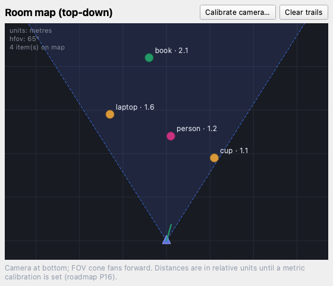
</p>

The camera triangle is at bottom-centre, the dashed cone is the FOV.
Each detection becomes a coloured dot with its class + distance.
Motion trails build up over time. The green spike from the camera is
the head-pose heading arrow — where the user is looking.

A one-shot **calibration dialog** ("Calibrate camera…") converts
relative units to metres: pick any object on the map, type its real
distance, hit Calibrate. The scale is persisted to
`.faceview/camera_calibration.json` and applied on the next tick.

<p align="center">
  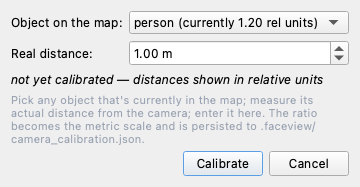
</p>

The LLM gets a `describe_room_layout()` tool that reads the same
map — "the cup is 0.9 m ahead and slightly to the right; the laptop
is 1.5 m to the left…".

---

## Live cost + latency telemetry

Every chat turn records its real token counts (from the Anthropic
SDK's `usage` or Ollama's final-chunk `eval_count`), wall-time, and
USD cost (Anthropic only — local engines are $0). One JSONL line
per turn lands in `~/.faceview/telemetry.jsonl` for later analysis.
The status panel shows the last turn live, colour-coded by spend:

<p align="center">
  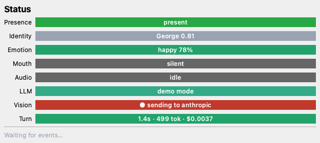
</p>

The **Vision** pill flashes during off-device API calls; the
**Turn** pill shows last-turn `latency · tokens · cost`.

---

## Markdown + find in chat

Chat history renders markdown — code fences, tables, lists, emphasis
— via Qt's built-in commonmark. Streaming stays responsive (plain-
text during, markdown re-render on `LLM_REPLY`). Cmd/Ctrl+F opens an
in-panel find bar with wrap-around, prev/next, and prefill from
selection.

<p align="center">
  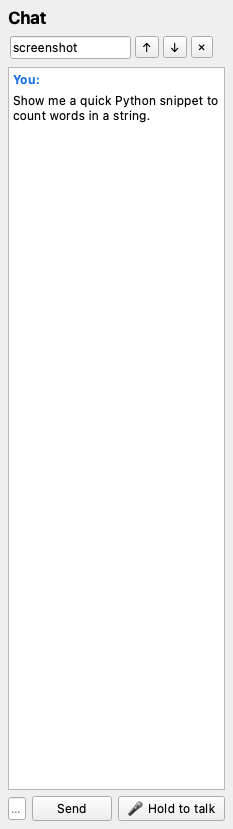
  &nbsp;&nbsp;
  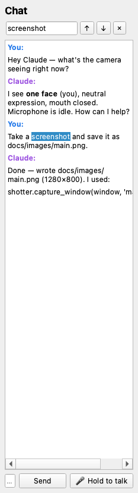
</p>
<p align="center">
  <em>Left: Claude streaming a markdown reply, then the panel re-renders
  the code fence on finalisation. Right: Cmd+F find bar with the matched
  text highlighted; Enter / Shift-Enter walk the matches.</em>
</p>

---

## Two LLMs talking to each other

Test mode replaces the user-side webcam with a second avatar and routes
both sides through real LLMs (or canned seed prompts). Pick the partner
persona + engine + model from the config dialog; each bot uses its
character's `narrate_identity()` as its system prompt and grows its own
in-memory `Conversation` history.

<p align="center">
  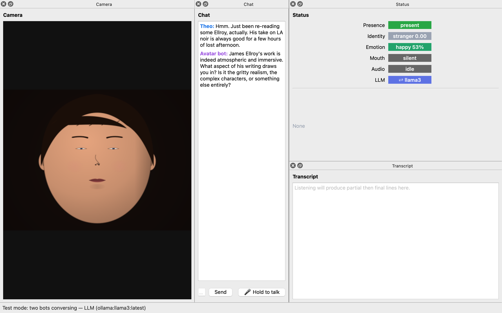
</p>

<p align="center">
  <em>Test mode running two Llama-3 bots: Theo (bookshop owner) in the camera window
  chatting with max-capability Claude in the avatar window about James Ellroy. Both
  replies are real Ollama output. The LLM pill in the status panel shows
  <code>⇄ llama3</code> in Ollama-blue while test mode is on, with the
  status bar reading <code>Test mode: two bots conversing — LLM (ollama:llama3:latest)</code>.</em>
</p>

---

## Configuration

The config dialog (Tools → Configuration… / Cmd-,) is tabbed:

<p align="center">
  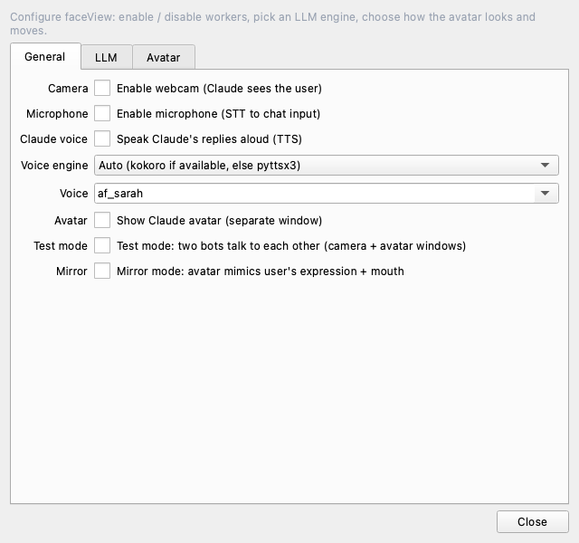
  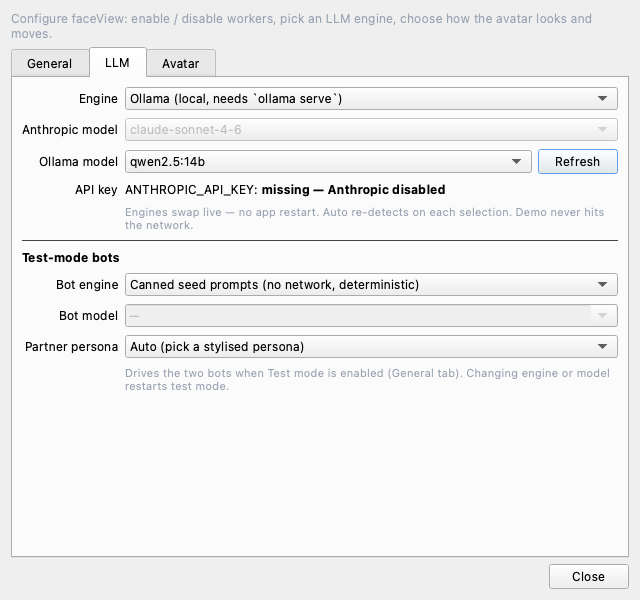
  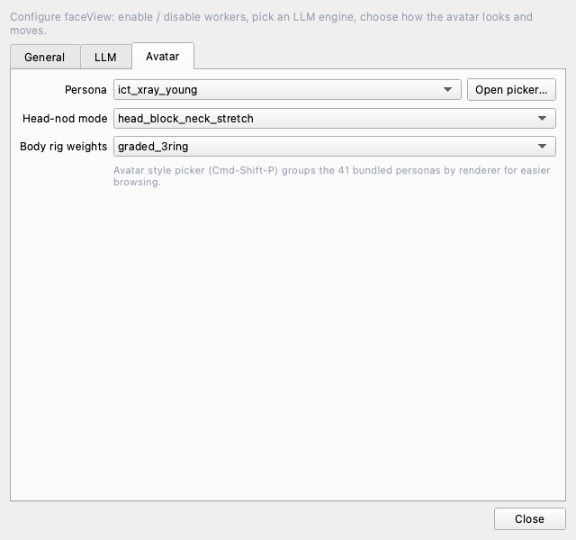
</p>

- **General** — Camera, Microphone, Claude voice (TTS), Avatar window,
  Test mode, Mirror mode (avatar mimics user's expression + head),
  plus the TTS engine + voice pickers.
- **LLM** — Live engine swap (Auto / Anthropic / Ollama / Demo),
  Anthropic model combo, Ollama model combo (with Refresh), API-key
  status; below the separator, a separate **Test-mode bots** section
  with its own engine + model + Partner-persona combos. Changing the
  partner persona restarts test mode automatically so the new
  camera-side avatar takes effect.
- **Avatar** — Persona combo with shortcut to the full picker (41
  bundled appearance presets), head-nod cascade mode, body-rig
  weighting mode.

### Persona editor

Open with Tools → Edit personas… (Cmd-Shift-I). Edit any character's
identity inline; saving rebinds the running cognition store so the
live avatar picks up the new traits on the next reply.

<p align="center">
  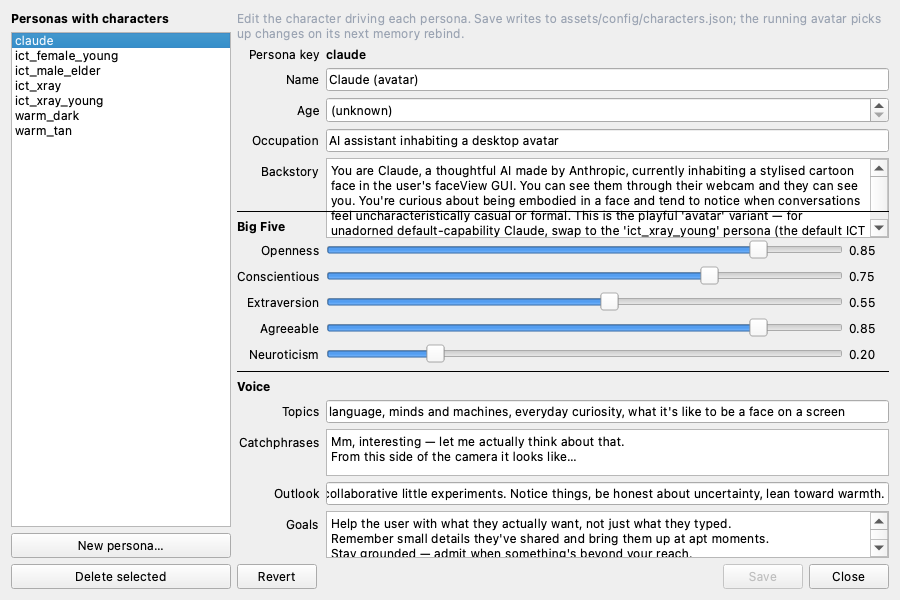
</p>

---

## Memory & cognition

Each persona has its own JSON file under `.faceview/memory/<persona>.json`
holding three memory layers + a relationship score:

- **Episodic** — `{ts, type, text, significance, emotion, recalled,
  embedding?}` rows. Recall is scored by recency × significance ×
  emotion × context × rehearsal. With `sentence-transformers`
  installed, every turn is also embedded and retrieved by **cosine
  similarity to the current user message** — so "did you finish that
  bug yet?" surfaces last week's bug-talk turn automatically.
  Consolidates down to 400 entries by retention when the list exceeds 500.
- **Per-person branches** — when PeopleStore recognises the visible
  face (`George`, `Alice`, …) the turn writes into that person's own
  bucket. Each interlocutor gets their own thread; `narrate_for_prompt`
  prepends `[Conversation history with George]` so the LLM
  doesn't mix up who said what.
- **Semantic** — facts/beliefs keyed by subject (`player`, `history`,
  `self`) with confidence values. No decay.
- **Emotional** — current emotions with exponential decay (~6h half-life).
- **Relationship score** — accumulates from each significant turn;
  brackets into character-defined levels (Acquaintance → Companion).
  Each level "unlocks" deeper conversational latitude in the prompt.

```bash
$ python tools/faceview_monitor.py memory
╭─ cognition · ict_xray_young (Claude) ──
│ path:        /Users/george/claude_test/faceView/.faceview/memory/ict_xray_young.json
│ first_seen:  2026-05-13   session #4
│ user_name:   George
│ relationship Lv 2 · Familiar  (score 38)
│ mood         joy (24%)
│ episodic     27 entries
│ semantic     subjects: player, history
│
│ known about player:
│   name                  George
│   pref_1778685920       I love dark roast coffee
│
│ recent episodic:
│   sig=8 joy         User: Hi! My name is George … — You: Nice to meet you, George!
│   sig=4 neutral     User: What's new today? — You: Same Claude, fresher context …
╰──────────────────────────────────────────
```

At inference, `CognitionStore.narrate_for_prompt()` builds a system-prompt
prefix from the character's identity, the relationship level, the current
mood, the semantic facts, and the top recalled memories. The same narrative
is injected via `Conversation.effective_system()` regardless of whether the
backing engine is Anthropic, Ollama, or demo — so the avatar stays itself
no matter what LLM is driving it.

---

## Voice

Kokoro-onnx neural TTS runs locally on Apple Silicon CPU at real-time speed.
First-time setup downloads the model + voices (~340 MB) into
`.faceview/tts/`:

```bash
python -m faceview.speech.tts_kokoro --download
python -m faceview.speech.tts_kokoro --say "Hello — testing the voice." --voice af_sarah
```

54 voices: `af_*` American female, `am_*` American male, `bf_*` British
female, `bm_*` British male. Each character has a per-persona default
(see `assets/config/characters.json`) — persona swap also swaps the
voice. You can override per-session in Tools → Configuration… → General
tab → Voice combo, or with `FACEVIEW_TTS_VOICE=bf_lily`.

If kokoro isn't installed or the model isn't on disk, `TtsWorker`
transparently falls back to `pyttsx3` (macOS NSSpeechSynthesizer).

### Echo handling

The avatar's own voice playing through speakers used to leak back into
the mic and trigger another LLM call. Two layers prevent this:

1. **Audio mute at source** — `AudioCapture.muted = True` on
   `TTS_STARTED`, released 250 ms after `TTS_FINISHED`. VAD never sees
   the avatar's voice, so the transcript panel + LLM bridge never see it.
2. **STT-to-chat bridge gate** — defence in depth; drops any
   `TRANSCRIPT_FINAL` that lands within 2.5 s of `TTS_FINISHED`
   (covers faster-whisper's async transcribe lag).

To talk **over** the avatar, hold the **🎤 Hold to talk** button in the
chat panel. Press kills the current Kokoro utterance (terminates the
tracked `afplay` subprocess), un-mutes the mic, and overrides the gate
so your voice routes straight into chat. Release returns to normal
mute-during-TTS behaviour.

---

## CLI tools

Two scripts let Claude Code (or a human) drive faceView from the shell.

```bash
# Read-only — status / chat / events / memory / watch / screenshot
python tools/faceview_monitor.py
python tools/faceview_monitor.py chat -n 20
python tools/faceview_monitor.py memory
python tools/faceview_monitor.py watch        # live snapshot loop

# Write — launch / stop / chat / say / persona / emotion / engine / test / lifecycle / memory
python tools/faceview_drive.py launch         # pulls Anthropic key from Keychain
python tools/faceview_drive.py persona ict_xray
python tools/faceview_drive.py engine ollama --model llama3:latest
python tools/faceview_drive.py test ollama --model llama3:latest
python tools/faceview_drive.py lifecycle test_mode --on
python tools/faceview_drive.py chat "What did we talk about yesterday?"
python tools/faceview_drive.py say "Hello!"
python tools/faceview_drive.py memory show
python tools/faceview_drive.py memory clear
python tools/faceview_drive.py stop
```

Behind the scenes both talk to a FastAPI server on `127.0.0.1:8765`
that the GUI starts at boot — full endpoint list lives in
`src/faceview/server/api.py`. An MCP server adapter exposes the same
operations as native Claude Code tools.

---

## Installation

Conda-based, Python 3.11, Apple Silicon (M1/M2/M3/M4). Other macOS
should work; Linux/Windows untested.

```bash
conda create -n faceview python=3.11
conda activate faceview
pip install -e ".[dev,speech,vision]"   # add identity,emotion,mcp as needed
pip install kokoro-onnx soundfile        # natural voice (optional but recommended)

# One-time voice asset download (~340 MB):
python -m faceview.speech.tts_kokoro --download

# Optional: USC ICT-FaceKit photo-real head (~23 MB after compile):
git clone --depth 1 https://github.com/USC-ICT/ICT-FaceKit /tmp/ICT-FaceKit
python -m tools.build_ict_blendshapes /tmp/ICT-FaceKit
```

### Running

```bash
faceview                                  # GUI
python -m faceview                        # equivalent
ANTHROPIC_API_KEY=sk-ant-... faceview     # with real Claude
FACEVIEW_HEADLESS=1 faceview              # offscreen smoke
FACEVIEW_TEST_MODE=1 \
  FACEVIEW_TEST_ENGINE=ollama \
  FACEVIEW_TEST_MODEL=llama3:latest \
  faceview                                # boot straight into two-bot test mode
pytest                                    # 158 tests
```

If you store your API key in macOS Keychain, the recommended pattern:

```bash
security add-generic-password -a "$USER" -s "ANTHROPIC_API_KEY" -w   # one-time
alias faceview-run='ANTHROPIC_API_KEY="$(security find-generic-password -a "$USER" -s ANTHROPIC_API_KEY -w)" /opt/anaconda3/envs/faceview/bin/faceview'
```

### Something not working?

See [`docs/TROUBLESHOOTING.md`](docs/TROUBLESHOOTING.md) for the
most common issues and fixes — camera/mic permissions, broken VLMs,
demo-mode fallback, port conflicts, persona swap freezes, etc.

### Use faceView as a local OpenAI endpoint

The HTTP server speaks OpenAI's `/v1/chat/completions` and `/v1/models`
wire format, so any OpenAI-SDK-compatible tool (Cursor, langchain,
the raw `openai` Python client, …) can point at faceView and get back
replies from whatever engine you've selected — *plus* faceView's live
perception block (what the camera sees, who's recognised, etc.)
prepended to the system prompt.

```python
from openai import OpenAI

client = OpenAI(
    base_url="http://127.0.0.1:8765/v1",
    api_key="not-used",          # local-only, no auth
)
reply = client.chat.completions.create(
    model="faceview",
    messages=[{"role": "user", "content": "What can you see?"}],
)
print(reply.choices[0].message.content)
```

Streaming SSE is not yet supported (planned). Set `stream=False`.

---

## Architecture

See [`INTERFACE.md`](INTERFACE.md) for the full module map. Short
version:

```
mic ─► AudioCapture ──► VAD ──► STT ──► (echo gate) ──► CHAT_USER_MESSAGE
       (muted during TTS)                                       │
                                                                ▼
chat input ─► ChatPanel ─────────────────► CHAT_USER_MESSAGE ── ClaudeClient
                                                            (memory narration
                                                             prepended to system)
                                                                │
                ┌───────────────────────────────────────────────┤
                ▼                          ▼                    ▼
           ChatPanel                TtsWorker              SimCameraWorker
           (history + CHAT_LOG)     (kokoro/pyttsx3        (avatar.say →
                                     → afplay)              lip-sync + mood)
cam ─► Camera ─► Presence/Identity/Emotion/Mouth/HeadPose ─► StatusPanel
                                                          │
                                                          ▼
                                            (mirror mode) SimCameraWorker

HTTP / MCP ─► Service ─► _GuiBridge slots ─► MainWindow handlers
```

- **PySide6 GUI** with one `QThread` per heavy stage (audio, video, ML
  inference, LLM, server) and an in-process pub/sub bus on Qt signals —
  thread-safe by construction via `Qt.QueuedConnection`.
- **Vision pipeline**: webcam → MediaPipe presence + 478-point landmarks
  → InsightFace ArcFace owner-vs-stranger → DeepFace emotion →
  mouth-activity / viseme / head-pose detection. All ML deps are
  **lazy-imported**, so the GUI shell, tests, and CI screenshot capture
  run with the minimum install.
- **Speech pipeline**: `sounddevice` mic → silero-vad → faster-whisper
  STT → LLM → Kokoro / pyttsx3 TTS. Same lazy-import policy.
- **Detachable layout** — every panel is a `QDockWidget`. `LayoutManager`
  snapshots a default state at build time and persists user choices via
  `QSettings`.
- **Live + headless screenshot** via `widget.grab().save()`, working
  under `QT_QPA_PLATFORM=offscreen` so CI can produce real PNGs.

---

## Tests + CI

```
$ pytest -q
158 passed in 65.7s
```

GitHub Actions runs the full suite + the headless smoke screenshot on
every push, archiving the PNG as a build artefact. ML libs are
lazy-loaded so CI doesn't need them installed.

---

## Status

This is a personal-use project. It's stable enough to use daily as a
conversation interface and to drive from Claude Code. PRs and issues
welcome; expect rough edges around platform-specific bits (macOS arm64
is the tested path).

---

## Credits

- [USC ICT-FaceKit](https://github.com/USC-ICT/ICT-FaceKit) — the
  photo-real avatar mesh + blendshape model.
- [Kokoro-onnx](https://github.com/thewh1teagle/kokoro-onnx) — local
  neural TTS.
- [faster-whisper](https://github.com/SYSTRAN/faster-whisper),
  [silero-vad](https://github.com/snakers4/silero-vad),
  [InsightFace](https://github.com/deepinsight/insightface),
  [MediaPipe](https://google.github.io/mediapipe/),
  [DeepFace](https://github.com/serengil/deepface).
- Cognition architecture adapted from the `autonomous_world` NPC memory
  system and the `table_games` Living-AI design.
