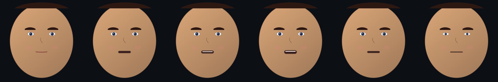
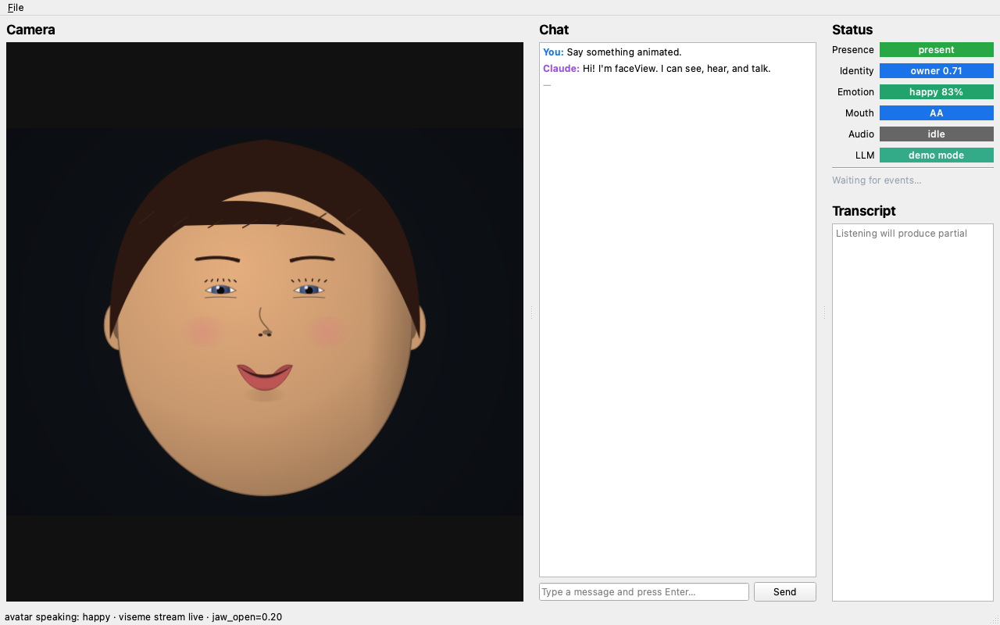

# faceView

A multimodal desktop GUI for interacting with Claude and other LLMs — chat, microphone, webcam, and a face-aware status surface, with a local control API and stdio MCP server so a Claude Code session can drive the GUI itself.

<p align="center">
  
</p>

The left panel is a live camera feed. The centre is a chat panel with streaming Claude responses (with a built-in demo-mode fallback if no API key is set). The right column shows live presence/identity/emotion/mouth-activity status pills, plus a streaming STT transcript. A 127.0.0.1 FastAPI control plane and a stdio MCP server expose every operation as a tool — so Claude Code can take a screenshot of itself, send a chat message, query camera state, or speak text out of the GUI without leaving the conversation.

## Highlights

- **PySide6 GUI** with one `QThread` per heavy stage (audio, video, ML inference, LLM, server) and an in-process pub/sub bus built on Qt signals — thread-safe by construction via `Qt.QueuedConnection`.
- **Vision pipeline**: webcam → MediaPipe presence + 478-point landmarks → InsightFace ArcFace owner-vs-stranger → DeepFace emotion → mouth-activity / viseme detection. All ML deps are **lazy-imported**, so the GUI shell, tests, and CI screenshot capture run with the minimum install.
- **Speech pipeline**: `sounddevice` mic → silero-vad → faster-whisper STT → Anthropic Claude → pyttsx3 TTS. Same lazy-import policy.
- **Procedural simulated face** (`faceview.vision.sim_face` + `SimCameraWorker`) that drives the entire pipeline without a webcam — used for headless tests and the screenshots in this README.
- **Live + headless screenshot** capture via `widget.grab().save()`, working under `QT_QPA_PLATFORM=offscreen` so CI can produce real PNGs.
- **Driveable from Claude Code** via either:
  - `POST /chat`, `/speak`, `/screenshot` and `GET /state`, `/events` on `127.0.0.1:8765`
  - or a stdio MCP server exposing the same operations as native Claude Code tools.

## Lip-reading scope — read this first

A genuine open-vocabulary visual-speech-recognition (VSR) model from Python on Apple Silicon is **not practical in 2026**: the SOTA checkpoints (AV-HuBERT / Auto-AVSR) assume CUDA + fairseq, MPS throughput is poor, and word-error-rate on a casual webcam still sits in the 30–60% range without audio.

What faceView actually ships under "lip reading" is **mouth-activity + viseme detection**: per-frame jaw-open, mouth-funnel, and mouth-pucker coefficients derived from MediaPipe's 478-point face mesh, mapped to a small viseme alphabet (`AA / EE / OO / MM / FV`) plus a binary `speaking / silent`. It's enough to drive face-rig animation and to gate STT on visible mouth motion. For *transcripts*, faceView routes audio to faster-whisper.

The upgrade path to real VSR (Auto-AVSR converted to ONNX and run via `onnxruntime` CoreML EP) is documented in `INTERFACE.md` and is purely additive — drop in a new `vision/visual_asr.py` worker that subscribes to `FRAME` events.

## Talking avatar — face for Claude

faceView ships a FACS-based talking avatar (`vision.avatar.TalkingAvatar`) that can be driven by any text. It's wired to the LLM so that when Claude finishes a reply, the avatar mouths the words. Set `FACEVIEW_AVATAR=1` and the camera panel becomes Claude's face.

<p align="center">
  
</p>

*Avatar saying "Hi! I'm faceView. I can see, hear, and talk." in real time. The mouth is driven by viseme targets from a phoneme timeline; idle blinks, breathing, and saccadic gaze drift run continuously.*

<p align="center">
  
</p>

*Six frames sampled across the same utterance — closed-mouth `PP / REST` between syllables, `AA` and `OH` vowels reach into open-mouth shapes.*

<p align="center">
  
</p>

*The GUI mid-utterance: avatar in the camera panel, the chat showing Claude's reply, status pills tracking emotion / viseme / presence. This is what `FACEVIEW_AVATAR=1 faceview` looks like during conversation.*

### How it works

1. **FACS Action Units** — 12 standard AUs (`AU1` Inner-brow-raise … `AU26` Jaw-drop) form the avatar's state. Adapted from [FaceForge](https://github.com/gddickinson/face_app)'s anatomy app, with `assets/config/expressions.json` providing 12 emotion presets (neutral, happy, sad, angry, surprised, fear, disgust, contempt, pout, kiss, pain, thinking).
2. **Visemes** — a 15-class alphabet (`PP / FF / TH / DD / SS / SH / KK / RR / AA / EH / IH / OH / UH / WW / REST`) maps each phoneme to a small AU activation. Mouth AUs (25/26/22/20/12) only — the rest are left to the baseline expression, so a smiling speaker keeps smiling.
3. **Speech engine** — text is tokenised into ARPAbet phonemes via a small bundled CMU pronouncing dictionary, with a letter-rule fallback for unknown words. Phonemes are timed at ~12/sec by default, producing a `TimedViseme` schedule the avatar plays back.
4. **Idle behaviours** — `AutoBlink` (every 2.5–5 s), `AutoBreathing` (slow sinusoid biasing AU9 / AU25), `AutoSaccade` (gaze drift every 1.2–2.6 s). All run continuously, even mid-utterance.
5. **Smoothing** — exponential approach (`rate × dt`) toward target AUs each tick. Produces visibly natural motion without per-AU velocity tracking.

The whole avatar is render-agnostic: `TalkingAvatar.tick()` returns a `FaceParams`, and the same `render_face()` renderer paints it. Tests verify that `say(text)` produces real jaw motion, blinks fire within 6 seconds idle, and emotion changes flip the smile sign.

### Personas

Appearance is decoupled from animation. The dynamic AU state (mouth open, brow up, smile, gaze, blink) lives on `FaceState`; the static identity bits (skin tone, hair colour, lip colour, background) live in a `Persona` overlay applied to every rendered frame. Bundled presets are in `src/faceview/assets/config/personas.json` and a `Persona` switch is exposed via HTTP `POST /avatar/persona` and MCP `set_persona`.

<p align="center">
  
</p>

*Seven bundled personas at the same `happy` baseline — same animation pipeline, different appearance overlay.*

### Coarticulation

Visemes are not played as discrete steps. Each viseme contributes during a triangular envelope (40 ms attack, 60 ms release) around its phoneme slot, and `viseme_blend_at()` returns a per-AU weighted-max across active envelopes. The result is continuous AU trajectories: an outgoing viseme fades down as the incoming one ramps up, instead of snapping. The avatar's smoothing layer then sits on top.

### Anatomical renderer

A second renderer is shipped alongside the stylised one. It is built on a hand-curated 86-point landmark template at canonical face proportions (rule of thirds, eye spacing, lip rest position) and the **43 expression muscles** lifted from [FaceForge's anatomy app](https://github.com/gddickinson/face_app)'s catalogue, with each muscle's AU map preserved. Every AU activation resolves through the muscle layer to produce 2D vertex displacements with anatomical direction — zygomaticus major lifts the lip corner up *and* outward, levator labii alaeque nasi pulls the upper lip and nasal wing together, mentalis pushes the lower lip up via the chin pad — before any drawing happens.

<p align="center">
  
</p>

*Eight FACS-driven emotions rendered through the anatomical pipeline. Same model — only the AU mix changes. Note the nasolabial fold appearing on smiles, the cupid's bow + vermillion border on lips, the mentolabial sulcus under the lower lip, the limbal ring on each iris, and AU9-driven nasal wrinkle on disgust.*

<p align="center">
  
  
</p>

*Left: anatomical talking avatar — same FACS / phoneme / viseme pipeline as the stylised version, just routed through the muscle-driven landmark deformation. Right: the **anatomy overlay** mode shows each muscle glowing in proportion to its current activation, fiber direction drawn as a tick. Watch zygomaticus light up on a smile, orbicularis oris contract for `OO`, mentalis fire when the jaw closes.*

Three modes are exposed via a `Persona`'s `render_mode` field, switchable at runtime via `POST /avatar/persona`:

| Mode | Use |
|---|---|
| `stylised` | Default — the layered cartoony pipeline. Cheap, expressive, persona-friendly. |
| `anatomical` | Muscle-driven 2D portrait with shaded skin, real eye anatomy, cupid's bow, mentolabial sulcus. |
| `anatomy_overlay` | Same as anatomical plus a translucent muscle-activation layer. Inspection / teaching / debugging emotion presets. |
| `wireframe` | Landmark dots + group polylines on a dark background. Cheap, deterministic, shows the underlying template. |

## The simulated face — building blocks

`FaceParams` is the renderer's input (yaw / pitch / eye_open / jaw_open / smile / brow_raise / pupil_x / pupil_y / skin_hue). `FaceState` is the animation pipeline's input (12 FACS AUs + head pose + gaze + blink). The bridge is `face_state_to_params()`. A `SimCameraWorker` posts `FRAME` events identical in shape to the real `CameraWorker`'s output, plus matching `PRESENCE / MOUTH_ACTIVITY / EMOTION / IDENTITY` events.

<p align="center">
  
  
  
  
</p>

*Procedural face in four `FaceParams` presets. Used for tests, README screenshots, and any time a real camera isn't available.*

## States captured live from the GUI

<p align="center">
  
</p>

*Demo conversation, owner present, smiling — the emotion pill turns green at 81%, mouth pill stays "silent" because the closed-mouth smile has `jaw_open ≈ 0`.*

<p align="center">
  
</p>

*Voice activity detected, transcript panel showing a partial line followed by the final segment, mouth pill snapped to viseme `AA`, audio pill to "speech".*

<p align="center">
  
</p>

*Brow-raised, jaw-open: emotion classifier flips to "surprise" at 84%.*

<p align="center">
  
</p>

*No face in frame — presence drops to "absent", identity goes blank, vision analysis backs off automatically.*

## Layout

```
faceView/
├── src/faceview/
│   ├── core/           event bus, event types, logger, errors, config
│   ├── gui/            PySide6 widgets + screenshotter
│   ├── speech/         audio capture, VAD, STT, TTS  (lazy ML)
│   ├── vision/         camera, presence, identity, emotion, mouth
│   │                   + sim_face / sim_camera (procedural face)
│   ├── llm/            Anthropic client + conversation history
│   ├── server/         FastAPI + stdio MCP, sharing one Service layer
│   └── utils/
├── tests/              pytest-qt unit + smoke tests
├── tools/              run_headless, capture_gui_screenshots, run_mcp_server
└── docs/images/        screenshots used in this README (auto-captured)
```

See [`INTERFACE.md`](INTERFACE.md) for the full module map and event flow diagram.

## Install

```bash
conda create -n faceview python=3.11 -y
conda activate faceview

# Minimum: GUI + LLM + control API + tests
pip install -e ".[dev]"

# Optional ML extras (lazy-imported — install only what you want)
pip install -e ".[speech]"     # sounddevice, faster-whisper, silero-vad, pyttsx3
pip install -e ".[vision]"     # opencv-python, mediapipe
pip install -e ".[identity]"   # insightface, onnxruntime (with CoreML EP on macOS)
pip install -e ".[emotion]"    # deepface
pip install -e ".[mcp]"        # mcp Python SDK
pip install -e ".[full]"       # everything above
```

The minimum install is enough to launch the GUI, run all 17 unit tests, and capture every screenshot in this README.

## Run

```bash
# Live GUI
faceview
# or
python -m faceview

# Offscreen smoke run — boots, seeds demo state, saves docs/images/headless_smoke.png
python -m tools.run_headless

# Re-capture all README screenshots
python -m tools.capture_gui_screenshots

# Render the talking-avatar GIF + frame strip + monitor PNG
python -m tools.animate_talking
python -m tools.animate_talking --text "Hello, world." --emotion happy --speed 1.0

# Run the GUI in avatar mode (camera panel = Claude's animated face)
FACEVIEW_AVATAR=1 faceview

# Stdio MCP server (Claude Code launches this automatically once configured)
python -m tools.run_mcp_server
```

Set `ANTHROPIC_API_KEY` to enable real Claude responses. Without it, the chat falls back to a deterministic echo so the GUI is fully usable.

```bash
export ANTHROPIC_API_KEY=sk-ant-...
export FACEVIEW_MODEL=claude-sonnet-4-6     # default
```

## Driving the GUI from Claude Code

### Option 1 — HTTP control plane (always on at 127.0.0.1:8765)

```bash
curl -X POST http://127.0.0.1:8765/chat -H 'content-type: application/json' \
     -d '{"text":"What can you see?"}'

curl -X POST http://127.0.0.1:8765/speak -H 'content-type: application/json' \
     -d '{"text":"Screenshot saved."}'

curl -X POST http://127.0.0.1:8765/screenshot -H 'content-type: application/json' \
     -d '{"name":"my_shot.png"}'

# Avatar control (only effective when FACEVIEW_AVATAR=1)
curl -X POST http://127.0.0.1:8765/avatar/emotion -H 'content-type: application/json' \
     -d '{"name":"surprised"}'
curl -X POST http://127.0.0.1:8765/avatar/persona -H 'content-type: application/json' \
     -d '{"name":"claude"}'
curl -X POST http://127.0.0.1:8765/avatar/say -H 'content-type: application/json' \
     -d '{"text":"Hello there.","speed":1.0}'
curl http://127.0.0.1:8765/avatar/personas

curl http://127.0.0.1:8765/state    # camera state
curl http://127.0.0.1:8765/events   # last 50 events
```

### Option 2 — stdio MCP server

Add to your `~/.claude.json` (or run `claude mcp add ...`):

```json
"mcpServers": {
  "faceview": {
    "command": "python",
    "args": ["-m", "tools.run_mcp_server"]
  }
}
```

Then a Claude Code session can call `send_chat`, `speak`, `camera_state`, `list_events`, `screenshot`, `set_emotion`, `set_persona`, `avatar_say`, and `list_personas` as native tools. Both adapters wrap the same `Service` layer in `src/faceview/server/service.py`, so adding an op only takes one implementation.

## Testing

```bash
pytest                # 63 tests, all green, <2 s
```

Tests run fully offscreen (`QT_QPA_PLATFORM=offscreen` is set in `tests/conftest.py`) and require only the `[dev]` extra — no real ML model is loaded.

## Threading model

Heavy work runs off the GUI thread on dedicated `QThread` workers, communicating exclusively via the `EventBus` Qt signal:

```
mic → AudioCapture → VAD → STT ──┐
                                 ▼
                              EventBus(Transcript)
                                 │
chat input → ChatPanel ──────────┴────► ClaudeClient ──► EventBus(LLM_TOKEN, LLM_REPLY)
                                                         │
                                                         ▼
                                                ChatPanel + TTSWorker

cam → CameraWorker ─► PresenceDetector ─► EventBus(Presence)
                   ├─► IdentityRecognizer ──► EventBus(Identity)
                   ├─► EmotionAnalyzer    ──► EventBus(Emotion)
                   └─► MouthAnalyzer      ──► EventBus(MouthActivity)

HTTP / MCP ─► Service ─(invokeMethod / signals)─► same handlers
```

`Qt.QueuedConnection` marshals every cross-thread call back onto the receiving object's thread, so no widget is ever touched off-main.

## Status

Alpha. The GUI shell, control API, MCP adapter, simulated-face pipeline, screenshot capture, and tests all work. Real-camera and real-microphone paths are implemented but each requires its optional extra to be installed; they have not been exhaustively tuned. Lip-reading is, and will remain, viseme/mouth-activity rather than open-vocabulary VSR.

## License

MIT.
