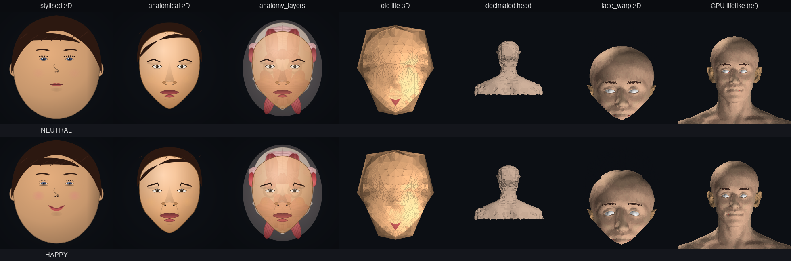

# Realism assessment — 2026-05-07

How each render mode compares to standard anatomical proportions
(Loomis head construction, classical art canon, the BP3D scan our
GPU lifelike mode renders directly).

## Reference: anatomical proportions for an adult human head

| Landmark | Position (% of head height from top) |
|---|---|
| Hairline | 12–15% |
| Brow ridge | 33% |
| Eye line | 50% (vertical midpoint) |
| Nose tip | 66% (lower third) |
| Lip line | 75% |
| Chin | 100% |
| Head ratio | ~1:1.45 height:width |
| Eye spacing | 1 eye-width between inner corners |
| Head width | 5 eye-widths |

GPU lifelike (`faceforge_3d_gpu`) is our reference — it renders
real BP3D anatomical scans, so its proportions are medical-grade.

## Mode-by-mode assessment

  

### `stylised 2D` — cartoony (deliberate, not realistic)
- **Strengths**: clean, expressive, fast (~60 fps), well-suited to chat avatars
- **Weaknesses**: head ratio close to 1:1 (real is 1:1.45), eye line too high (~40%), simplified single-shape features
- **Realism**: **3/10**. By design.
- **Use**: friendly UI avatar.

### `anatomical 2D` — refined proportions
- **Strengths**: BP3D-aligned eye line at midpoint, taller head, proper feature placement, almond eyes with sclera/iris/limbus, cupid's bow on lips, anatomical brows
- **Weaknesses**: still flat shading, no depth, hair as separate cap, looks like an illustration not a photograph
- **Realism**: **5/10**. Best in the 2D illustrative track.
- **Use**: educational / anatomical reference; nicer-than-cartoony avatar.

### `anatomy_layers` / `_skull` / `_brain` / `_xray` — peelable illustration
- Educational mode, not meant to read as a real face. Skip in the realism comparison.

### `old lite 3D` (deprecated)
- **Strengths**: none — Delaunay over 86 hand-placed points crosses feature boundaries (eye→forehead, lip→cheek), producing a chaotic spider-web that doesn't read as a face.
- **Realism**: **1/10**.
- **Status**: deprecated in favour of `head_decimated_3d`.

### `head_decimated_3d` — real BP3D shape, low poly
- **Strengths**: real anatomical silhouette + neck + shoulders, proper head ratio, 3D rotation, no spider-web topology
- **Weaknesses**: no facial features visible (no eyes / lips / eyebrows / nostrils — uniform skin colour), CPU-only ~8 fps
- **Realism**: **5/10** for shape, **1/10** for feature definition. Bald mannequin.
- **Use**: 3D head silhouette + future GPU upgrade target.

### `face_warp 2D` — photo-real animated
- **Strengths**: photo-real skin texture, all features visible (eyes / brows / nose / lips / ears), FACS-driven deformation, animatable, ~25 fps CPU
- **Weaknesses**: locked to front view, no open-mouth (texture is closed), warp artifacts at silhouette edges
- **Realism**: **8/10** — most lifelike *animated* mode.
- **Use**: photo-real avatar for chat/talking; pair with GPU lifelike for rotation.

### `faceforge_3d_gpu` (reference) — full BP3D
- **Strengths**: real anatomy, all features (sclera-bright eyes, eyebrows, ears, lips visible), rotatable, smooth Phong shading, ~36 fps GPU
- **Weaknesses**: bald (no hair mesh), no expression deformation (static face), needs Apple GPU + 145 STL meshes
- **Realism**: **9/10**. The medical-grade reference.
- **Use**: photo-real 3D portrait, rotation demos.

## Realism scorecard summary

| Mode | Shape | Features | Skin | Animation | Rotation | Score |
|---|---|---|---|---|---|---|
| stylised 2D | 4 | 5 | 2 | 9 | n/a | 3/10 |
| anatomical 2D | 6 | 6 | 3 | 9 | n/a | 5/10 |
| old lite 3D | 1 | 1 | 2 | 4 | 5 | 1/10 |
| head_decimated_3d | 7 | 1 | 4 | n/a | 7 | 5/10 |
| face_warp 2D | 8 | 8 | 9 | 8 | 0 | **8/10** |
| GPU lifelike | 9 | 8 | 7 | 0 | 9 | **9/10** |

The pattern is clear: **`face_warp_2d` and `faceforge_3d_gpu` are
the realistic modes**; everything else is either stylised on
purpose or hits a fundamental limitation.

## Honest gap to a real photograph

A real photograph has, beyond what we render today:
- **Hair** — not in any of our modes (BP3D doesn't include hair).
- **Skin micro-texture** — pores, slight redness, vellus hair. Our
  GPU rendering uses flat per-mesh material; lifelike from a few
  meters away but obvious from close.
- **Subsurface scattering** — light penetrates skin and re-emits.
  Pixar / Apple's renderers do this; our flat Phong doesn't.
- **Eye specular highlights and tear film** — present in
  `face_warp_2d` (from the source GPU render), partially missing
  in `faceforge_3d_gpu` (no per-eye specular pass).
- **Asymmetry** — real faces are slightly asymmetric. All our
  modes are bilaterally symmetric.

## Ranked next steps

Each entry: **A** = anticipated realism gain, **E** = effort estimate.

| ID | Item | A | E | Notes |
|---|---|---|---|---|
| 1 | Multi-angle texture atlas for `face_warp_2d` | high | 1 session | Render BP3D at 5–7 yaw angles, blend nearest two during rotation. Photo-real face that *also* rotates. Highest impact for realism. |
| 2 | Open-mouth texture variant for `face_warp_2d` | medium | 2 hours | Render BP3D with jaw open via TMJ rotation, blend by AU26. Adds visible teeth/inner mouth during speech. Cheap. |
| 3 | GPU path for `head_decimated_3d` | medium | half session | Route the decimated mesh through `gpu_renderer`. Animatable real head shape at 100+ fps, replaces the slow CPU path. |
| 4 | AU-driven mesh deformation on GPU lifelike | very high | 2–3 sessions | Apply our 86-landmark AU pipeline as vertex displacements on BP3D meshes. Result: photo-real *animated* rotatable head — the highest-realism endpoint. |
| 5 | Eye / lip / brow overlays for `head_decimated_3d` | low | half session | 2D feature sprites composited on the decimated mesh. Cheaper than full texturing. |
| 6 | Hair mesh for `faceforge_3d_gpu` | medium | 1–2 sessions | Bundle a parametric hair mesh; mass + strand highlights. Hard to do well; most BP3D scans don't ship hair. |
| 7 | Stylised 2D proportional refinement | low | hours | Pull more BP3D measurements into the cartoon renderer for closer-to-real proportions. |

## Recommendation for the next session

**Items 1 + 2** combined: ship a **multi-angle, jaw-aware face_warp**.
That single change takes our most-realistic-animated mode (`face_warp_2d`)
from "front view only, closed mouth" to "rotates ±45°, mouth opens
during speech" — covering the two biggest visible limitations. After
that, item 4 (AU on GPU lifelike) is the long-term target.

Items 3 and 5 are quality-of-life upgrades that can slot in between.
Items 6 and 7 are lower priority unless the use case demands them.
